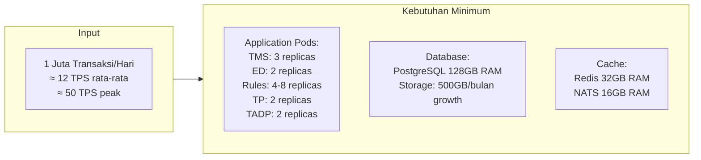
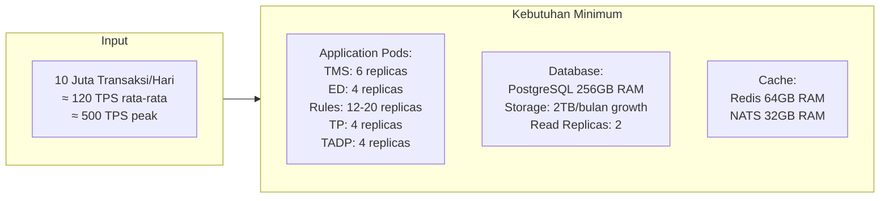
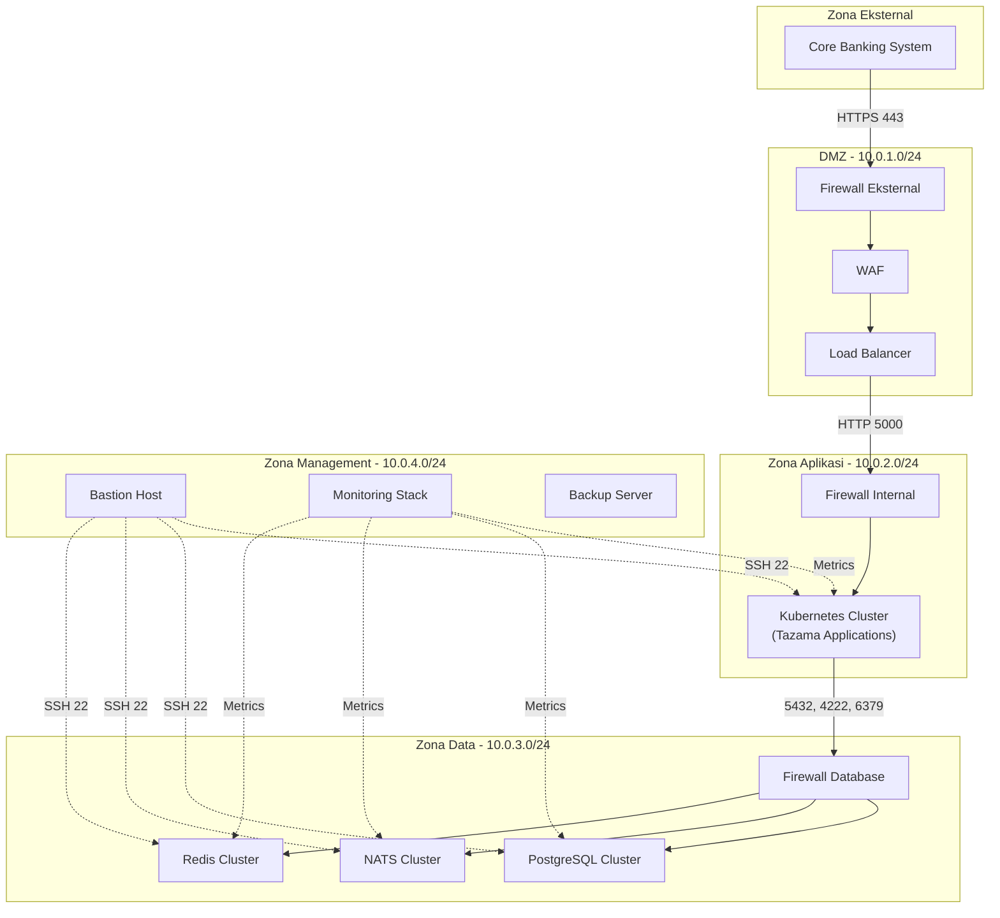
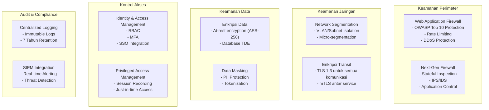
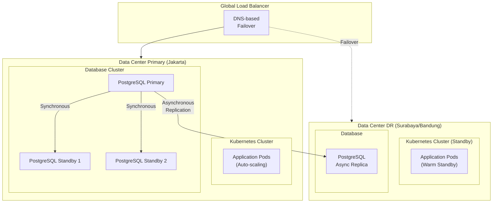
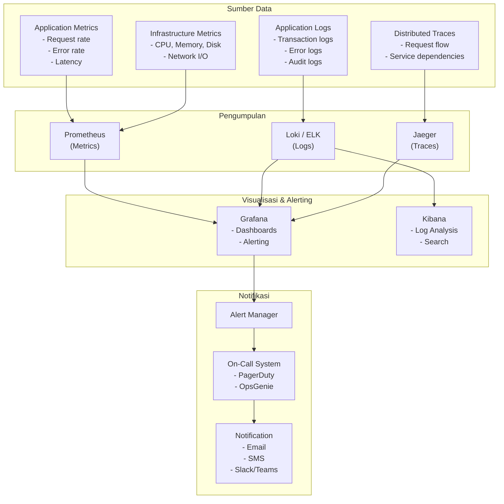
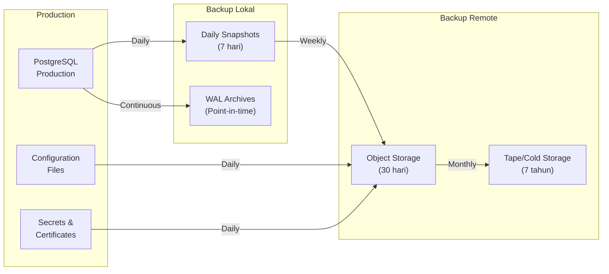
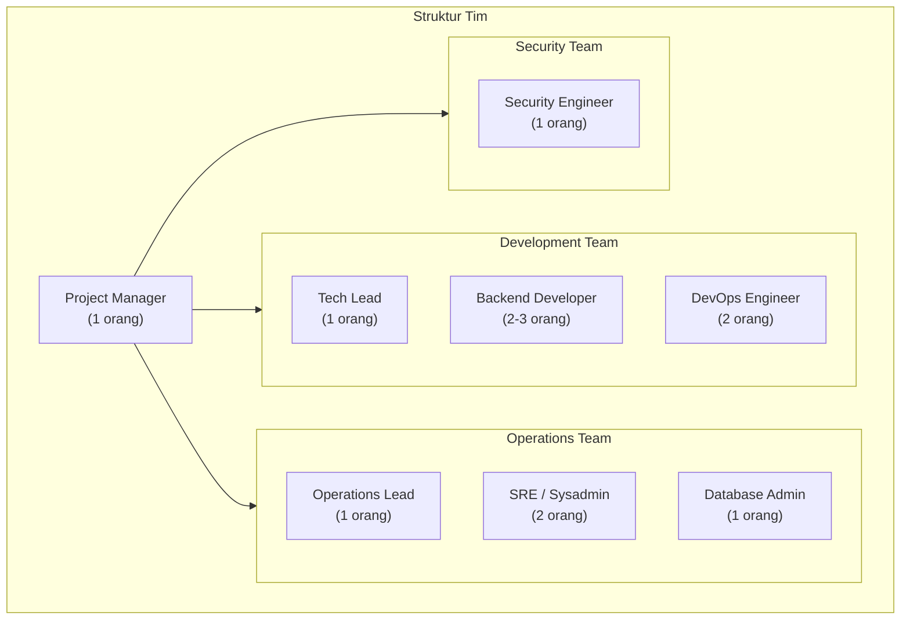
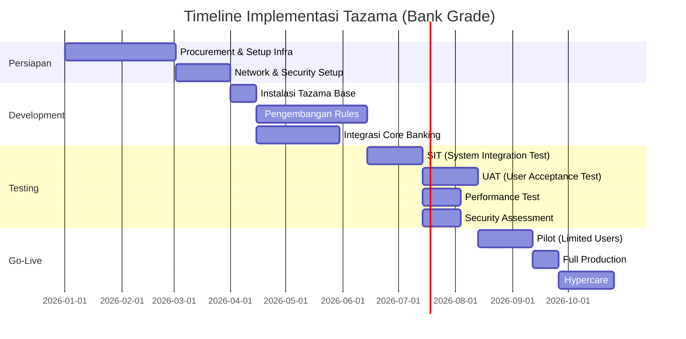

# Infrastruktur Tazama untuk Standar Perbankan
## Rekomendasi Arsitektur Production-Ready

---

## Pendahuluan

Dokumen ini menjelaskan kebutuhan infrastruktur untuk menjalankan sistem Tazama dengan standar yang layak untuk industri perbankan. Infrastruktur ini dirancang untuk memenuhi kebutuhan ketersediaan tinggi (high availability), keamanan, skalabilitas, dan kepatuhan regulasi.

---

## Arsitektur Umum

```mermaid
flowchart TB
    subgraph INTERNET["Internet / Jaringan Eksternal"]
        CLIENT["Sistem Core Banking"]
    end
    
    subgraph DMZ["DMZ (Demilitarized Zone)"]
        WAF["Web Application Firewall"]
        LB["Load Balancer<br/>(Primary + Standby)"]
    end
    
    subgraph INTERNAL["Jaringan Internal Bank"]
        subgraph KUBERNETES["Kubernetes Cluster"]
            subgraph APP["Application Layer"]
                TMS1["TMS Pod 1"]
                TMS2["TMS Pod 2"]
                TMS3["TMS Pod 3"]
                ED1["Event Director 1"]
                ED2["Event Director 2"]
                RULES["Rule Processors<br/>(Auto-scaling)"]
                TP1["Typology Processor 1"]
                TP2["Typology Processor 2"]
                TADP1["TADP 1"]
                TADP2["TADP 2"]
            end
        end
        
        subgraph DATA["Data Layer"]
            subgraph PGCLUSTER["PostgreSQL Cluster"]
                PG_PRIMARY["PostgreSQL Primary"]
                PG_STANDBY1["PostgreSQL Standby 1"]
                PG_STANDBY2["PostgreSQL Standby 2"]
            end
            
            subgraph NATSCLUSTER["NATS Cluster"]
                NATS1["NATS Node 1"]
                NATS2["NATS Node 2"]
                NATS3["NATS Node 3"]
            end
            
            subgraph CACHE["Cache Cluster"]
                REDIS1["Redis/Valkey Primary"]
                REDIS2["Redis/Valkey Replica 1"]
                REDIS3["Redis/Valkey Replica 2"]
            end
        end
        
        subgraph MONITORING["Monitoring & Logging"]
            PROMETHEUS["Prometheus"]
            GRAFANA["Grafana"]
            ELK["ELK Stack<br/>(Elasticsearch, Logstash, Kibana)"]
            ALERTMANAGER["Alert Manager"]
        end
    end
    
    subgraph DR["Disaster Recovery Site"]
        DR_CLUSTER["Kubernetes Cluster<br/>(Standby)"]
        DR_DB["PostgreSQL<br/>(Async Replica)"]
    end
    
    CLIENT --> WAF
    WAF --> LB
    LB --> TMS1 & TMS2 & TMS3
    
    PG_PRIMARY -.->|Replication| PG_STANDBY1 & PG_STANDBY2
    PG_PRIMARY -.->|Async Replication| DR_DB
    
    NATS1 <--> NATS2 <--> NATS3
    REDIS1 -.->|Replication| REDIS2 & REDIS3
```

---

## Spesifikasi Server

### Environment Production

#### Kubernetes Worker Nodes (Application Layer)

| Komponen | Jumlah | CPU | RAM | Storage | Keterangan |
|----------|--------|-----|-----|---------|------------|
| Worker Node | 6 minimum | 16 vCPU | 64 GB | 500 GB SSD | Untuk menjalankan pods aplikasi |
| Master Node | 3 | 8 vCPU | 32 GB | 200 GB SSD | Control plane Kubernetes |

#### Database Servers

| Komponen | Jumlah | CPU | RAM | Storage | Keterangan |
|----------|--------|-----|-----|---------|------------|
| PostgreSQL Primary | 1 | 16 vCPU | 128 GB | 2 TB NVMe SSD | Database utama |
| PostgreSQL Standby | 2 | 16 vCPU | 128 GB | 2 TB NVMe SSD | Synchronous replication |
| PostgreSQL DR | 1 | 16 vCPU | 128 GB | 2 TB NVMe SSD | Di site DR, async replication |

#### Message Queue & Cache

| Komponen | Jumlah | CPU | RAM | Storage | Keterangan |
|----------|--------|-----|-----|---------|------------|
| NATS Server | 3 | 8 vCPU | 32 GB | 200 GB SSD | Clustered untuk HA |
| Redis/Valkey | 3 | 8 vCPU | 64 GB | 200 GB SSD | Primary + 2 Replica |

#### Infrastructure Services

| Komponen | Jumlah | CPU | RAM | Storage | Keterangan |
|----------|--------|-----|-----|---------|------------|
| Load Balancer | 2 | 4 vCPU | 16 GB | 100 GB SSD | Active-Passive |
| WAF | 2 | 8 vCPU | 32 GB | 200 GB SSD | Active-Passive |
| Monitoring Stack | 3 | 8 vCPU | 64 GB | 1 TB SSD | Prometheus, Grafana, ELK |
| Bastion Host | 2 | 4 vCPU | 8 GB | 100 GB SSD | Untuk akses administrasi |

---

## Estimasi Kapasitas Berdasarkan Volume Transaksi

### Skenario: 1 Juta Transaksi per Hari

### Skenario: 10 Juta Transaksi per Hari

---

## Arsitektur Jaringan

### Segmentasi Jaringan

| Zona | CIDR | Fungsi | Akses |
|------|------|--------|-------|
| DMZ | 10.0.1.0/24 | Load Balancer, WAF | Dari internet (terbatas) |
| Aplikasi | 10.0.2.0/24 | Kubernetes cluster | Dari DMZ saja |
| Data | 10.0.3.0/24 | Database, Message Queue, Cache | Dari zona aplikasi saja |
| Management | 10.0.4.0/24 | Monitoring, Bastion, Backup | Dari internal network |

---

## Keamanan

### Komponen Keamanan yang Dibutuhkan

### Checklist Keamanan untuk Bank

| Kategori | Requirement | Implementasi |
|----------|-------------|--------------|
| **Enkripsi** | Data at rest | AES-256, PostgreSQL TDE |
| | Data in transit | TLS 1.3, mTLS antar service |
| **Akses** | Authentication | OAuth 2.0 / OIDC, MFA |
| | Authorization | RBAC dengan principle of least privilege |
| | Privileged Access | PAM dengan session recording |
| **Audit** | Logging | Centralized logging, immutable |
| | Retention | Minimum 7 tahun (sesuai regulasi BI) |
| | Monitoring | SIEM integration, real-time alerting |
| **Network** | Segmentation | VLAN, firewall antar zona |
| | Protection | WAF, IPS/IDS, DDoS protection |
| **Compliance** | PCI-DSS | Jika memproses data kartu |
| | ISO 27001 | Information security management |
| | POJK | Sesuai regulasi OJK |

---

## High Availability & Disaster Recovery

### Arsitektur HA

### Target SLA

| Metrik | Target | Keterangan |
|--------|--------|------------|
| **Availability** | 99.95% | Maksimal downtime 4.38 jam/tahun |
| **RPO** (Recovery Point Objective) | < 1 menit | Data loss maksimal saat disaster |
| **RTO** (Recovery Time Objective) | < 15 menit | Waktu recovery ke DR site |
| **Response Time** | < 500ms | P95 latency untuk API |
| **Throughput** | Sesuai sizing | Berdasarkan volume transaksi |

---

## Monitoring & Observability

### Dashboard yang Dibutuhkan

| Dashboard | Metrik Utama | Pengguna |
|-----------|--------------|----------|
| **Executive** | Total transaksi, Alert rate, System health | Manajemen |
| **Operations** | TPS, Latency, Error rate, Queue depth | Tim Operasional |
| **Security** | Failed auth, Suspicious patterns, WAF blocks | Tim Security |
| **Infrastructure** | CPU, Memory, Disk, Network | Tim Infra |
| **Database** | Connections, Query performance, Replication lag | DBA |

---

## Backup & Recovery

### Kebijakan Backup

| Tipe Data | Frekuensi | Retensi | Lokasi |
|-----------|-----------|---------|--------|
| Database Full | Harian | 7 hari lokal, 30 hari remote | Local + Object Storage |
| Database WAL | Continuous | 7 hari | Local + Object Storage |
| Configuration | Harian | 30 hari | Object Storage |
| Logs | Real-time | 90 hari online, 7 tahun archive | ELK + Cold Storage |
| Secrets | Saat perubahan | 30 hari | Encrypted Object Storage |

---

## Estimasi Biaya Infrastruktur

### On-Premise (Data Center Sendiri)

| Komponen | Jumlah | Estimasi Biaya (IDR) | Keterangan |
|----------|--------|----------------------|------------|
| Server Aplikasi | 6 unit | 1.8 Miliar | @300 juta/unit |
| Server Database | 4 unit | 2 Miliar | @500 juta/unit (high-spec) |
| Server Infrastruktur | 6 unit | 1.2 Miliar | @200 juta/unit |
| Storage Enterprise | 1 set | 1.5 Miliar | SAN/NAS dengan redundancy |
| Network Equipment | 1 set | 800 Juta | Switch, Firewall, Load Balancer |
| **Total CAPEX** | | **7.3 Miliar** | Belum termasuk DR site |
| Lisensi Software | Tahunan | 500 Juta/tahun | OS, Database, Monitoring |
| Maintenance | Tahunan | 730 Juta/tahun | 10% dari CAPEX |
| **Total OPEX** | | **1.23 Miliar/tahun** | |

### Cloud (AWS/GCP/Azure)

| Komponen | Spesifikasi | Estimasi Biaya (USD/bulan) |
|----------|-------------|---------------------------|
| Kubernetes (EKS/GKE/AKS) | 6 worker nodes | $2,500 |
| Database (RDS/Cloud SQL) | Multi-AZ, 128GB RAM | $3,000 |
| Cache (ElastiCache/Memorystore) | 3 nodes | $800 |
| Message Queue (MSK/Pub-Sub) | 3 brokers | $600 |
| Load Balancer | Application LB | $200 |
| Storage | 5TB SSD | $500 |
| Monitoring | CloudWatch/Stackdriver | $300 |
| Network | Data transfer, VPN | $500 |
| **Total** | | **$8,400/bulan** |
| | | **≈ 130 Juta IDR/bulan** |

*Catatan: Estimasi untuk skenario 1 juta transaksi/hari. Biaya akan meningkat sesuai volume.*

---

## Tim yang Dibutuhkan

### Kebutuhan SDM

| Role | Jumlah | Tanggung Jawab |
|------|--------|----------------|
| Project Manager | 1 | Koordinasi project, timeline, stakeholder |
| Tech Lead | 1 | Arsitektur, code review, technical decision |
| Backend Developer | 2-3 | Pengembangan rule, integrasi, API |
| DevOps Engineer | 2 | CI/CD, infrastructure as code, deployment |
| SRE / Sysadmin | 2 | Operasional harian, monitoring, incident response |
| DBA | 1 | Database administration, performance tuning |
| Security Engineer | 1 | Security review, compliance, audit |
| **Total** | **10-12 orang** | |

---

## Timeline Implementasi

### Estimasi Timeline

| Fase | Durasi | Keterangan |
|------|--------|------------|
| Persiapan Infrastruktur | 3 bulan | Procurement, setup, security |
| Development & Integrasi | 2-3 bulan | Instalasi, rules, integrasi |
| Testing | 2 bulan | SIT, UAT, Performance, Security |
| Go-Live | 2 bulan | Pilot, production, hypercare |
| **Total** | **9-10 bulan** | Dari kick-off sampai production stable |

---

## Ringkasan

Untuk implementasi Tazama dengan standar perbankan, dibutuhkan:

1. **Infrastruktur** yang redundant dan tersebar di minimal 2 data center
2. **Keamanan** berlapis dengan enkripsi, segmentasi jaringan, dan audit trail
3. **High Availability** dengan target 99.95% uptime
4. **Tim** sekitar 10-12 orang dengan berbagai keahlian
5. **Investasi** sekitar 7-8 Miliar untuk on-premise atau 130 juta/bulan untuk cloud
6. **Waktu** sekitar 9-10 bulan dari awal sampai production

Implementasi ini bukan proyek sederhana dan membutuhkan perencanaan matang, tim yang kompeten, serta komitmen dari manajemen untuk memastikan keberhasilan.
