# Integrasi Kafka dengan Tazama

## Daftar Isi
0. [Alur Sederhana (TL;DR)](#0-alur-sederhana-tldr)
1. [Overview](#1-overview)
2. [Arsitektur Integrasi](#2-arsitektur-integrasi)
3. [Infrastruktur Minimal](#3-infrastruktur-minimal)
4. [Kafka Consumer Service](#4-kafka-consumer-service)
5. [Transformasi Data](#5-transformasi-data)
6. [Deployment](#6-deployment)
7. [Monitoring & Error Handling](#7-monitoring--error-handling)
8. [Spesifikasi Server](#8-spesifikasi-server)

---

## 0. Alur Sederhana (TL;DR)

### Gambaran Besar: Dari Transaksi sampai Alert

```mermaid
flowchart LR
    subgraph "1️⃣ SUMBER DATA"
        USER[👤 Nasabah]
        BANK[🏦 Core Banking]
    end
    
    subgraph "2️⃣ MESSAGE BROKER"
        KAFKA[📨 Kafka]
    end
    
    subgraph "3️⃣ JEMBATAN"
        CONSUMER[🔄 Kafka Consumer]
    end
    
    subgraph "4️⃣ TAZAMA"
        TAZAMA[🔍 Fraud Detection]
    end
    
    subgraph "5️⃣ OUTPUT"
        ALERT[🚨 Alert]
        DB[(📊 Database)]
    end
    
    USER -->|transfer| BANK
    BANK -->|kirim data| KAFKA
    KAFKA -.->|❌ pasif, tidak push| CONSUMER
    CONSUMER -->|✅ aktif tarik data| KAFKA
    CONSUMER -->|kirim ke API| TAZAMA
    TAZAMA -->|hasil| ALERT
    TAZAMA -->|simpan| DB
    
    style CONSUMER fill:#ff9,stroke:#f00,stroke-width:3px
```



### Alur Step-by-Step

```mermaid
flowchart TB
    subgraph "STEP 1: Transaksi Terjadi"
        S1A[Nasabah transfer Rp 50 juta]
        S1B[Core Banking catat transaksi]
        S1C[Data dikirim ke Kafka topic]
    end
    
    subgraph "STEP 2: Kafka Consumer Bekerja"
        S2A[Consumer polling Kafka<br/>setiap beberapa detik]
        S2B[Ambil data transaksi]
        S2C[Transform ke format ISO 20022]
    end
    
    subgraph "STEP 3: Kirim ke Tazama"
        S3A[HTTP POST ke TMS API]
        S3B[Tazama terima & proses]
    end
    
    subgraph "STEP 4: Evaluasi Fraud"
        S4A[Cek Rule: Nominal besar?]
        S4B[Cek Rule: Transaksi cepat beruntun?]
        S4C[Hitung total score]
    end
    
    subgraph "STEP 5: Hasil"
        S5A{Score > threshold?}
        S5B[✅ NORMAL<br/>Lanjut proses]
        S5C[🚨 ALERT<br/>Kirim notifikasi]
    end
    
    S1A --> S1B --> S1C
    S1C --> S2A
    S2A --> S2B --> S2C
    S2C --> S3A --> S3B
    S3B --> S4A --> S4B --> S4C
    S4C --> S5A
    S5A -->|Tidak| S5B
    S5A -->|Ya| S5C
    
    style S2A fill:#ff9,stroke:#f00,stroke-width:2px
    style S2B fill:#ff9,stroke:#f00,stroke-width:2px
    style S2C fill:#ff9,stroke:#f00,stroke-width:2px
```



### Kenapa Butuh Kafka Consumer?


**Analogi Sederhana:**
- **Kafka** = Kotak surat (pasif, cuma nyimpan)
- **Kafka Consumer** = Tukang pos (aktif ambil & antar)
- **Tazama** = Penerima surat

### Komponen yang Dibutuhkan

```mermaid
flowchart TB
    subgraph "🔴 SUDAH ADA di Bank"
        EXIST1[Core Banking System]
        EXIST2[Kafka Cluster]
    end
    
    subgraph "🟡 PERLU DIBUAT/DEPLOY"
        NEW1[Kafka Consumer Service<br/>Node.js / Python / Java]
    end
    
    subgraph "🟢 PERLU DEPLOY - Tazama Stack"
        subgraph "Infrastructure"
            INF1[(PostgreSQL)]
            INF2[(Valkey/Redis)]
            INF3[NATS]
        end
        
        subgraph "Processors"
            PROC1[TMS API]
            PROC2[Event Director]
            PROC3[Rule Processors]
            PROC4[Typology Processor]
            PROC5[TADP]
        end
    end
    
    EXIST1 --> EXIST2
    EXIST2 --> NEW1
    NEW1 --> PROC1
    
    style NEW1 fill:#ff9,stroke:#f00,stroke-width:3px
    style EXIST1 fill:#ddd
    style EXIST2 fill:#ddd
```



### Perbandingan: Setup Splunk vs Tazama


| Aspek | Ke Splunk | Ke Tazama |
|-------|-----------|-----------|
| Komponen tambahan | Logstash + Elasticsearch | Kafka Consumer saja |
| Kompleksitas | Tinggi | Rendah |
| Maintenance | 3 sistem | 1 sistem |

### Timeline Implementasi


### Checklist Implementasi


### Quick Summary

| Pertanyaan | Jawaban |
|------------|---------|
| **Butuh Logstash?** | ❌ Tidak |
| **Butuh Elasticsearch?** | ❌ Tidak |
| **Butuh apa?** | ✅ Kafka Consumer + Tazama Stack |
| **Siapa yang kirim data?** | Kafka Consumer (aktif polling) |
| **Format data ke Tazama?** | ISO 20022 (pacs.008, pacs.002) |
| **Endpoint Tazama?** | `POST /v1/evaluate/iso20022/pacs.008.001.10` |
| **Min server spec?** | 8 vCPU, 16GB RAM, 100GB SSD |

---

## 1. Overview

### Kenapa Butuh Kafka Consumer?

Kafka adalah sistem **pull-based** (pasif) - data tidak di-push keluar, melainkan consumer yang harus aktif menarik data dari topic. Tazama menerima transaksi via **REST API**, sehingga dibutuhkan komponen penghubung.


### Perbandingan dengan Setup Splunk


**Tidak perlu Logstash atau Elasticsearch** untuk integrasi ke Tazama.

---

## 2. Arsitektur Integrasi

### Arsitektur Lengkap


### Sequence Diagram - Alur Transaksi


---

## 3. Infrastruktur Minimal

### Komponen Wajib Tazama


### Tabel Komponen

| Komponen | Wajib? | Fungsi | Port |
|----------|--------|--------|------|
| PostgreSQL | ✅ | Database config & hasil | 5432 |
| Valkey/Redis | ✅ | In-memory cache | 6379 |
| NATS | ✅ | Internal message broker | 4222 |
| TMS API | ✅ | Gateway transaksi | 5000 |
| Event Director | ✅ | Routing | - |
| Rule Processor(s) | ✅ | Evaluasi rules | - |
| Typology Processor | ✅ | Agregasi rules | - |
| TADP | ✅ | Final decision | - |
| **Kafka Consumer** | ✅ | Bridge Kafka→Tazama | - |
| Hasura | ❌ | GraphQL API (dev) | 6100 |
| pgAdmin | ❌ | DB admin (dev) | 5050 |

---

## 4. Kafka Consumer Service

### Implementasi Node.js (KafkaJS)

```javascript
// kafka-tazama-consumer/src/index.js
const { Kafka } = require('kafkajs');
const axios = require('axios');

const kafka = new Kafka({
  clientId: 'tazama-consumer',
  brokers: process.env.KAFKA_BROKERS?.split(',') || ['localhost:9092'],
});

const consumer = kafka.consumer({ 
  groupId: 'tazama-consumer-group',
  sessionTimeout: 30000,
  heartbeatInterval: 3000,
});

const TAZAMA_TMS_URL = process.env.TAZAMA_TMS_URL || 'http://localhost:5000';

// Transform ke format ISO 20022
function transformToISO20022(rawTransaction) {
  return {
    TxTp: 'pacs.008.001.10',
    FIToFICstmrCdtTrf: {
      GrpHdr: {
        MsgId: rawTransaction.transactionId,
        CreDtTm: rawTransaction.timestamp || new Date().toISOString(),
        NbOfTxs: 1,
        SttlmInf: { SttlmMtd: 'CLRG' }
      },
      CdtTrfTxInf: {
        PmtId: {
          InstrId: rawTransaction.transactionId,
          EndToEndId: rawTransaction.referenceId || rawTransaction.transactionId
        },
        IntrBkSttlmAmt: {
          Amt: { Amt: rawTransaction.amount, Ccy: rawTransaction.currency || 'IDR' }
        },
        InstdAmt: {
          Amt: { Amt: rawTransaction.amount, Ccy: rawTransaction.currency || 'IDR' }
        },
        Dbtr: { Nm: rawTransaction.debtorName },
        DbtrAcct: { Id: { Othr: [{ Id: rawTransaction.debtorAccount }] } },
        DbtrAgt: { FinInstnId: { ClrSysMmbId: { MmbId: rawTransaction.debtorBank } } },
        Cdtr: { Nm: rawTransaction.creditorName },
        CdtrAcct: { Id: { Othr: [{ Id: rawTransaction.creditorAccount }] } },
        CdtrAgt: { FinInstnId: { ClrSysMmbId: { MmbId: rawTransaction.creditorBank } } }
      }
    }
  };
}

async function sendToTazama(transaction) {
  const iso20022Message = transformToISO20022(transaction);
  
  try {
    const response = await axios.post(
      `${TAZAMA_TMS_URL}/v1/evaluate/iso20022/pacs.008.001.10`,
      iso20022Message,
      { 
        headers: { 'Content-Type': 'application/json' },
        timeout: 5000 
      }
    );
    console.log(`✅ Sent ${transaction.transactionId}: ${response.status}`);
    return true;
  } catch (error) {
    console.error(`❌ Failed ${transaction.transactionId}:`, error.message);
    throw error;
  }
}

async function run() {
  await consumer.connect();
  await consumer.subscribe({ 
    topic: process.env.KAFKA_TOPIC || 'transactions',
    fromBeginning: false 
  });

  console.log('🚀 Kafka Consumer started, listening for transactions...');

  await consumer.run({
    eachMessage: async ({ topic, partition, message }) => {
      try {
        const transaction = JSON.parse(message.value.toString());
        await sendToTazama(transaction);
      } catch (error) {
        // Log error, bisa implement retry/DLQ di sini
        console.error('Processing error:', error.message);
      }
    },
  });
}

run().catch(console.error);
```

### Implementasi Python

```python
# kafka_tazama_consumer/main.py
import json
import os
import requests
from kafka import KafkaConsumer
from datetime import datetime

KAFKA_BROKERS = os.getenv('KAFKA_BROKERS', 'localhost:9092').split(',')
KAFKA_TOPIC = os.getenv('KAFKA_TOPIC', 'transactions')
TAZAMA_TMS_URL = os.getenv('TAZAMA_TMS_URL', 'http://localhost:5000')

def transform_to_iso20022(raw_txn):
    """Transform raw transaction to ISO 20022 pacs.008 format"""
    return {
        "TxTp": "pacs.008.001.10",
        "FIToFICstmrCdtTrf": {
            "GrpHdr": {
                "MsgId": raw_txn.get("transactionId"),
                "CreDtTm": raw_txn.get("timestamp", datetime.utcnow().isoformat()),
                "NbOfTxs": 1,
                "SttlmInf": {"SttlmMtd": "CLRG"}
            },
            "CdtTrfTxInf": {
                "PmtId": {
                    "InstrId": raw_txn.get("transactionId"),
                    "EndToEndId": raw_txn.get("referenceId", raw_txn.get("transactionId"))
                },
                "IntrBkSttlmAmt": {
                    "Amt": {"Amt": raw_txn.get("amount"), "Ccy": raw_txn.get("currency", "IDR")}
                },
                "InstdAmt": {
                    "Amt": {"Amt": raw_txn.get("amount"), "Ccy": raw_txn.get("currency", "IDR")}
                },
                "Dbtr": {"Nm": raw_txn.get("debtorName")},
                "DbtrAcct": {"Id": {"Othr": [{"Id": raw_txn.get("debtorAccount")}]}},
                "DbtrAgt": {"FinInstnId": {"ClrSysMmbId": {"MmbId": raw_txn.get("debtorBank")}}},
                "Cdtr": {"Nm": raw_txn.get("creditorName")},
                "CdtrAcct": {"Id": {"Othr": [{"Id": raw_txn.get("creditorAccount")}]}},
                "CdtrAgt": {"FinInstnId": {"ClrSysMmbId": {"MmbId": raw_txn.get("creditorBank")}}}
            }
        }
    }

def send_to_tazama(transaction):
    """Send ISO 20022 message to Tazama TMS"""
    iso_message = transform_to_iso20022(transaction)
    
    response = requests.post(
        f"{TAZAMA_TMS_URL}/v1/evaluate/iso20022/pacs.008.001.10",
        json=iso_message,
        headers={"Content-Type": "application/json"},
        timeout=5
    )
    response.raise_for_status()
    return response

def main():
    consumer = KafkaConsumer(
        KAFKA_TOPIC,
        bootstrap_servers=KAFKA_BROKERS,
        group_id='tazama-consumer-group',
        auto_offset_reset='latest',
        value_deserializer=lambda m: json.loads(m.decode('utf-8'))
    )
    
    print(f"🚀 Kafka Consumer started, listening on {KAFKA_TOPIC}...")
    
    for message in consumer:
        try:
            transaction = message.value
            send_to_tazama(transaction)
            print(f"✅ Sent {transaction.get('transactionId')}")
        except Exception as e:
            print(f"❌ Error: {e}")

if __name__ == "__main__":
    main()
```

---

## 5. Transformasi Data

### Format Input (dari Kafka)

```json
{
  "transactionId": "TXN-2026-001",
  "referenceId": "REF-001",
  "timestamp": "2026-02-06T10:30:00Z",
  "amount": 15000000,
  "currency": "IDR",
  "debtorName": "John Doe",
  "debtorAccount": "1234567890",
  "debtorBank": "BANK001",
  "creditorName": "Jane Smith",
  "creditorAccount": "0987654321",
  "creditorBank": "BANK002",
  "transactionType": "TRANSFER"
}
```

### Format Output (ke Tazama - ISO 20022 pacs.008)

```json
{
  "TxTp": "pacs.008.001.10",
  "FIToFICstmrCdtTrf": {
    "GrpHdr": {
      "MsgId": "TXN-2026-001",
      "CreDtTm": "2026-02-06T10:30:00Z",
      "NbOfTxs": 1,
      "SttlmInf": { "SttlmMtd": "CLRG" }
    },
    "CdtTrfTxInf": {
      "PmtId": {
        "InstrId": "TXN-2026-001",
        "EndToEndId": "REF-001"
      },
      "IntrBkSttlmAmt": {
        "Amt": { "Amt": 15000000, "Ccy": "IDR" }
      },
      "InstdAmt": {
        "Amt": { "Amt": 15000000, "Ccy": "IDR" }
      },
      "Dbtr": { "Nm": "John Doe" },
      "DbtrAcct": { "Id": { "Othr": [{ "Id": "1234567890" }] } },
      "DbtrAgt": { "FinInstnId": { "ClrSysMmbId": { "MmbId": "BANK001" } } },
      "Cdtr": { "Nm": "Jane Smith" },
      "CdtrAcct": { "Id": { "Othr": [{ "Id": "0987654321" }] } },
      "CdtrAgt": { "FinInstnId": { "ClrSysMmbId": { "MmbId": "BANK002" } } }
    }
  }
}
```

### Mapping Fields


---

## 6. Deployment

### Docker Compose

```yaml
# docker-compose.kafka-consumer.yaml
version: '3.8'

services:
  kafka-tazama-consumer:
    build: ./kafka-tazama-consumer
    container_name: kafka-tazama-consumer
    environment:
      - KAFKA_BROKERS=kafka:9092
      - KAFKA_TOPIC=transactions
      - TAZAMA_TMS_URL=http://tms:5000
      - NODE_ENV=production
    networks:
      - tazama-network
      - kafka-network
    restart: unless-stopped
    depends_on:
      - tms

networks:
  tazama-network:
    external: true
  kafka-network:
    external: true
```

### Dockerfile (Node.js)

```dockerfile
FROM node:20-alpine

WORKDIR /app

COPY package*.json ./
RUN npm ci --only=production

COPY src/ ./src/

CMD ["node", "src/index.js"]
```

### Arsitektur Deployment


---

## 7. Monitoring & Error Handling

### Error Handling Strategy


### Metrics yang Perlu Dimonitor

| Metric | Deskripsi | Alert Threshold |
|--------|-----------|-----------------|
| `consumer_lag` | Jumlah message belum diproses | > 1000 |
| `messages_processed_total` | Total message diproses | - |
| `messages_failed_total` | Total message gagal | > 10/menit |
| `tazama_response_time_ms` | Latency ke TMS | > 1000ms |
| `dlq_messages_total` | Message di Dead Letter Queue | > 0 |

### Health Check Endpoint

```javascript
// Tambahkan di consumer service
const express = require('express');
const app = express();

let isHealthy = true;
let lastProcessedTime = Date.now();

app.get('/health', (req, res) => {
  const timeSinceLastProcess = Date.now() - lastProcessedTime;
  
  if (!isHealthy || timeSinceLastProcess > 60000) {
    return res.status(503).json({ status: 'unhealthy' });
  }
  
  res.json({ 
    status: 'healthy',
    lastProcessed: new Date(lastProcessedTime).toISOString()
  });
});

app.listen(8080);
```

---

## Ringkasan


**Kesimpulan:**
1. **Tidak perlu** Logstash atau Elasticsearch
2. **Perlu** Kafka Consumer service sebagai bridge
3. Consumer melakukan **transformasi** ke format ISO 20022
4. Tazama menerima via **REST API** (TMS endpoint)

---

## 8. Spesifikasi Server

### Minimum Requirements

```mermaid
flowchart TB
    subgraph "DEVELOPMENT / POC"
        DEV[Single Server<br/>8 vCPU | 16GB RAM | 100GB SSD]
    end
    
    subgraph "PRODUCTION - Small"
        PS1[Tazama Server<br/>8 vCPU | 32GB RAM | 200GB SSD]
        PS2[Database Server<br/>4 vCPU | 16GB RAM | 500GB SSD]
    end
    
    subgraph "PRODUCTION - Medium"
        PM1[Tazama Cluster<br/>3x 8 vCPU | 32GB RAM]
        PM2[DB Cluster<br/>2x 8 vCPU | 32GB RAM | 1TB SSD]
        PM3[Kafka Consumer<br/>2x 4 vCPU | 8GB RAM]
    end
```

### Tabel Spesifikasi Detail

#### Development / POC (Single Node)

| Resource | Minimum | Recommended |
|----------|---------|-------------|
| vCPU | 4 cores | 8 cores |
| RAM | 8 GB | 16 GB |
| Storage | 50 GB SSD | 100 GB SSD |
| Network | 100 Mbps | 1 Gbps |
| OS | Ubuntu 22.04 / RHEL 8 | Ubuntu 22.04 LTS |

**Kapasitas:** ~100-500 TPS (transactions per second)

#### Production - Small (2 Nodes)

| Server | vCPU | RAM | Storage | Fungsi |
|--------|------|-----|---------|--------|
| **Tazama App** | 8 cores | 32 GB | 200 GB SSD | TMS, Processors, NATS, Valkey |
| **Database** | 4 cores | 16 GB | 500 GB SSD | PostgreSQL |

**Kapasitas:** ~500-1,000 TPS

#### Production - Medium (5+ Nodes)

| Server | Qty | vCPU | RAM | Storage | Fungsi |
|--------|-----|------|-----|---------|--------|
| **Tazama App** | 3 | 8 cores | 32 GB | 100 GB SSD | TMS, Processors (load balanced) |
| **PostgreSQL** | 2 | 8 cores | 32 GB | 1 TB SSD | Primary + Replica |
| **Kafka Consumer** | 2 | 4 cores | 8 GB | 50 GB SSD | Consumer service |
| **Valkey/Redis** | 2 | 4 cores | 16 GB | 50 GB SSD | Cache cluster |

**Kapasitas:** ~1,000-5,000 TPS

### Resource per Komponen


| Komponen | Min RAM | Min CPU | Storage |
|----------|---------|---------|---------|
| PostgreSQL | 4 GB | 2 cores | 100+ GB |
| Valkey/Redis | 2 GB | 1 core | 10 GB |
| NATS | 512 MB | 0.5 core | 5 GB |
| TMS API | 512 MB | 0.5 core | 1 GB |
| Event Director | 512 MB | 0.5 core | 1 GB |
| Rule Processor (each) | 512 MB | 0.5 core | 1 GB |
| Typology Processor | 512 MB | 0.5 core | 1 GB |
| TADP | 512 MB | 0.5 core | 1 GB |
| Kafka Consumer | 1 GB | 1 core | 5 GB |
| **TOTAL (minimal)** | **~12 GB** | **~8 cores** | **~130 GB** |

### Sizing berdasarkan Volume Transaksi


| Daily Volume | TPS (peak) | Deployment | Est. Monthly Cost* |
|--------------|------------|------------|-------------------|
| < 100K txn | ~10 TPS | Single node | $50-100 |
| 100K-1M txn | ~100 TPS | Single node (larger) | $100-200 |
| 1M-5M txn | ~500 TPS | 2 nodes | $300-500 |
| 5M-20M txn | ~2K TPS | 3-5 nodes | $800-1,500 |
| 20M-100M txn | ~5K TPS | 5-10 nodes | $2,000-5,000 |
| > 100M txn | > 10K TPS | Kubernetes cluster | $5,000+ |

*Estimasi cloud pricing (AWS/GCP/Azure)

### Network Requirements


| Connection | Port | Bandwidth | Latency |
|------------|------|-----------|---------|
| Kafka → Consumer | 9092 | 100+ Mbps | < 10ms |
| Consumer → TMS | 5000 | 100+ Mbps | < 5ms |
| TMS ↔ NATS | 4222 | 1+ Gbps | < 1ms |
| Processors ↔ PostgreSQL | 5432 | 1+ Gbps | < 1ms |
| Processors ↔ Valkey | 6379 | 1+ Gbps | < 1ms |

### Storage Calculation

```
Daily Storage = (Avg Message Size × Daily Transactions × Retention Days) + Buffer

Example:
- Avg message: 2 KB
- Daily txn: 1,000,000
- Retention: 90 days
- Buffer: 20%

Storage = (2 KB × 1M × 90) × 1.2 = ~216 GB

Recommended: 500 GB SSD untuk PostgreSQL
```

### Rekomendasi Cloud Instance

#### AWS

| Tier | Instance Type | vCPU | RAM | Use Case |
|------|---------------|------|-----|----------|
| Dev | t3.xlarge | 4 | 16 GB | Development/POC |
| Small | m6i.2xlarge | 8 | 32 GB | Production small |
| Medium | m6i.4xlarge | 16 | 64 GB | Production medium |
| DB | r6i.2xlarge | 8 | 64 GB | PostgreSQL dedicated |

#### GCP

| Tier | Machine Type | vCPU | RAM |
|------|--------------|------|-----|
| Dev | e2-standard-4 | 4 | 16 GB |
| Small | n2-standard-8 | 8 | 32 GB |
| Medium | n2-standard-16 | 16 | 64 GB |

#### Azure

| Tier | VM Size | vCPU | RAM |
|------|---------|------|-----|
| Dev | Standard_D4s_v3 | 4 | 16 GB |
| Small | Standard_D8s_v3 | 8 | 32 GB |
| Medium | Standard_D16s_v3 | 16 | 64 GB |

### Quick Start Recommendation

```mermaid
flowchart TB
    START[Mulai] --> Q1{Volume harian?}
    
    Q1 -->|< 1 juta txn| REC1[Single Server<br/>8 vCPU, 16-32GB RAM<br/>200GB SSD]
    Q1 -->|1-10 juta txn| REC2[2 Servers<br/>App: 8 vCPU, 32GB<br/>DB: 8 vCPU, 32GB, 500GB]
    Q1 -->|> 10 juta txn| REC3[Cluster 5+ nodes<br/>atau Kubernetes]
    
    REC1 --> COST1[~$100-200/bulan]
    REC2 --> COST2[~$400-800/bulan]
    REC3 --> COST3[~$2000+/bulan]
    
    style REC1 fill:#9f9
    style REC2 fill:#ff9
    style REC3 fill:#f99
```

**Untuk memulai (POC/Pilot):**
- 1 server: **8 vCPU, 16GB RAM, 100GB SSD**
- Cukup untuk testing dan volume rendah
- Bisa di-scale up sesuai kebutuhan

---

*Dokumentasi dibuat untuk integrasi Kafka dengan Tazama Transaction Monitoring System*
