# Kebutuhan Server untuk Tazama
## Dokumen Permintaan Infrastruktur

**Tanggal:** Februari 2026  
**Tujuan:** Permintaan server untuk sistem Tazama (Transaction Monitoring & Fraud Detection)

---

## 1. Ringkasan Eksekutif

Tazama adalah sistem **monitoring transaksi real-time** untuk mendeteksi fraud dan aktivitas mencurigakan. Sistem ini akan menerima data transaksi dari Kafka yang sudah ada, lalu menganalisis setiap transaksi berdasarkan aturan (rules) yang dikonfigurasi.

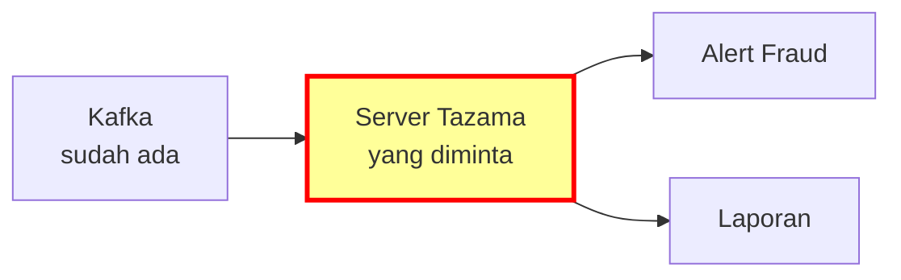

---

## 2. Kebutuhan Server

### 2.1 Pilihan Deployment

Terdapat 3 opsi deployment berdasarkan kebutuhan dan volume transaksi:

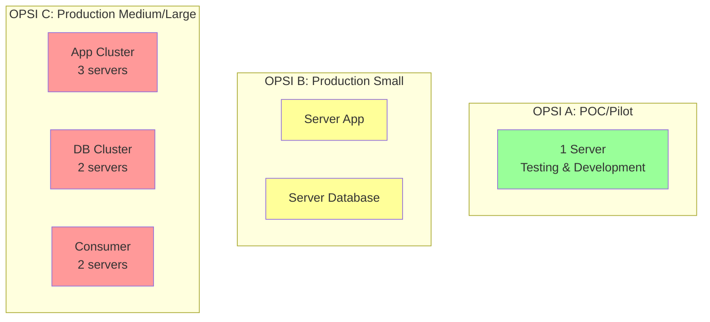

---

### 2.2 OPSI A: POC / Pilot (1 Server)

**Cocok untuk:** Testing, development, pilot project, volume rendah

| Komponen | Spesifikasi Minimum | Rekomendasi |
|----------|---------------------|-------------|
| **Jumlah Server** | 1 | 1 |
| **CPU** | 8 vCPU | 8 vCPU |
| **RAM** | 16 GB | 32 GB |
| **Storage** | 100 GB SSD | 200 GB SSD |
| **Network** | 1 Gbps | 1 Gbps |
| **OS** | RHEL 9 | RHEL 9 |

**Kapasitas:** ~100-500 TPS | ~1-5 juta transaksi/hari

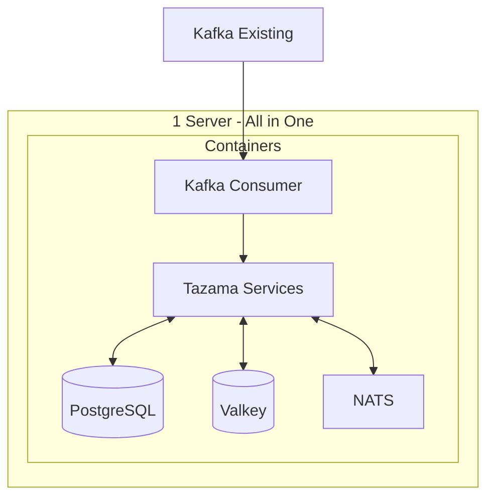

---

### 2.3 OPSI B: Production Small (2 Servers)

**Cocok untuk:** Production dengan volume sedang, membutuhkan pemisahan database

| Server | Fungsi | CPU | RAM | Storage | OS |
|--------|--------|-----|-----|---------|-----|
| **Server 1: Application** | Tazama + Consumer | 8 vCPU | 32 GB | 100 GB SSD | RHEL 9 |
| **Server 2: Database** | PostgreSQL + Valkey | 8 vCPU | 32 GB | 500 GB SSD | RHEL 9 |

**Total:** 2 servers | 16 vCPU | 64 GB RAM | 600 GB SSD

**Kapasitas:** ~500-2,000 TPS | ~5-20 juta transaksi/hari

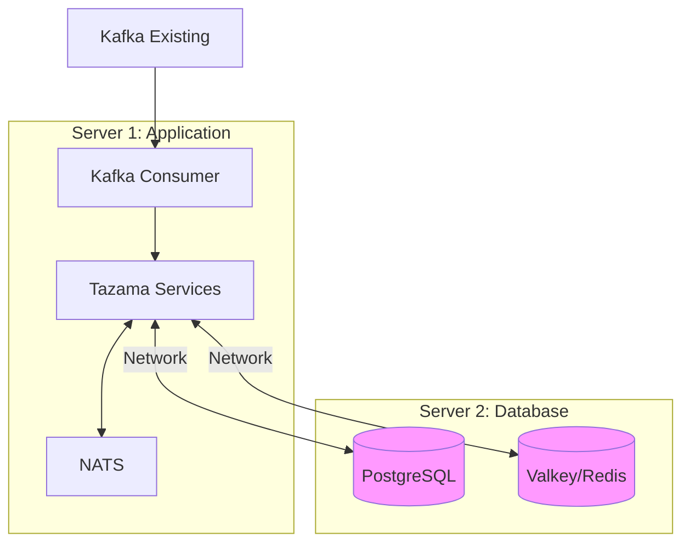

**Keuntungan pemisahan:**
- Database bisa di-backup tanpa ganggu aplikasi
- Performa lebih stabil
- Lebih mudah troubleshooting
- Database bisa di-scale terpisah

---

### 2.4 OPSI C: Production Medium/Large (5-7 Servers)

**Cocok untuk:** Production high-volume, butuh High Availability (HA), mission-critical

| Server | Qty | CPU | RAM | Storage | Fungsi |
|--------|-----|-----|-----|---------|--------|
| **App Server** | 3 | 8 vCPU | 32 GB | 100 GB SSD | Tazama Services (load balanced) |
| **DB Primary** | 1 | 8 vCPU | 64 GB | 1 TB SSD | PostgreSQL Primary |
| **DB Replica** | 1 | 8 vCPU | 64 GB | 1 TB SSD | PostgreSQL Replica (failover) |
| **Cache Cluster** | 2 | 4 vCPU | 16 GB | 50 GB SSD | Valkey/Redis Cluster |
| **Consumer** | 2 | 4 vCPU | 8 GB | 50 GB SSD | Kafka Consumer (HA) |

**Total:** 7 servers | 52 vCPU | 248 GB RAM | ~3.4 TB SSD

**Kapasitas:** ~2,000-10,000 TPS | ~20-100 juta transaksi/hari

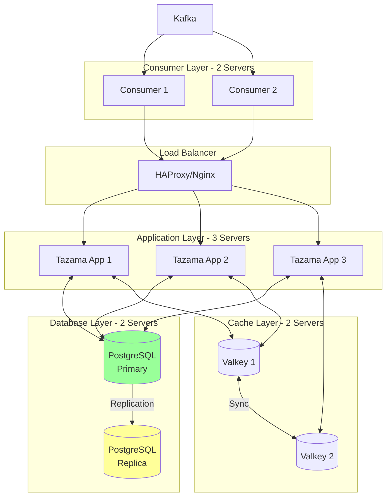

**Fitur High Availability:**
- Load balancer untuk distribusi traffic
- Database replication untuk failover
- Multiple consumer untuk redundancy
- Cache cluster untuk performa

---

### 2.5 Perbandingan Opsi

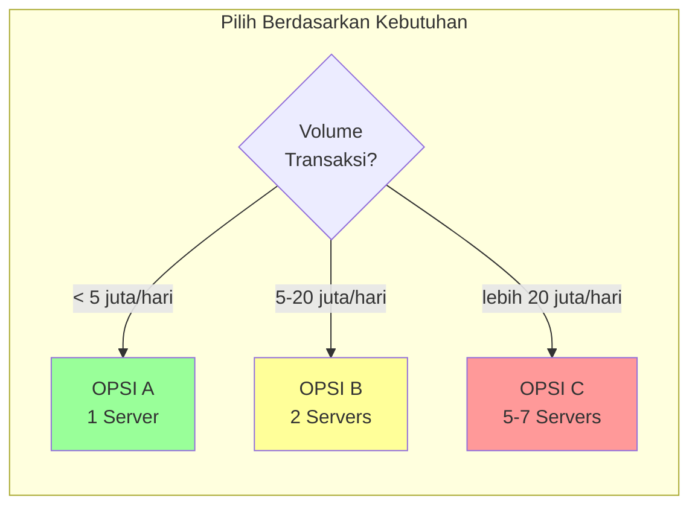

| Aspek | OPSI A (POC) | OPSI B (Prod Small) | OPSI C (Prod Large) |
|-------|--------------|---------------------|---------------------|
| **Jumlah Server** | 1 | 2 | 5-7 |
| **Total vCPU** | 8 | 16 | 52 |
| **Total RAM** | 16-32 GB | 64 GB | 248 GB |
| **Total Storage** | 100-200 GB | 600 GB | ~3.4 TB |
| **Kapasitas TPS** | 100-500 | 500-2,000 | 2,000-10,000 |
| **Transaksi/hari** | 1-5 juta | 5-20 juta | 20-100 juta |
| **High Availability** | ❌ | ❌ | ✅ |
| **DB Failover** | ❌ | ❌ | ✅ |
| **Estimasi Biaya** | $ | $$ | $$$$ |
| **Cocok untuk** | Testing, Pilot | Production kecil-sedang | Production besar |

---

### 2.6 Rekomendasi Berdasarkan Tahap

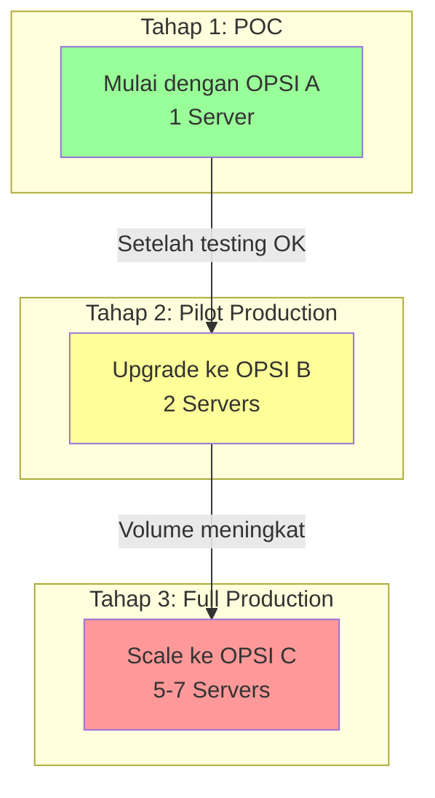

**Strategi yang disarankan:**
1. **Mulai dengan OPSI A** untuk POC dan testing
2. **Upgrade ke OPSI B** saat masuk production
3. **Scale ke OPSI C** jika volume transaksi meningkat signifikan

---

### 2.7 Visualisasi Kebutuhan Resource (OPSI A)

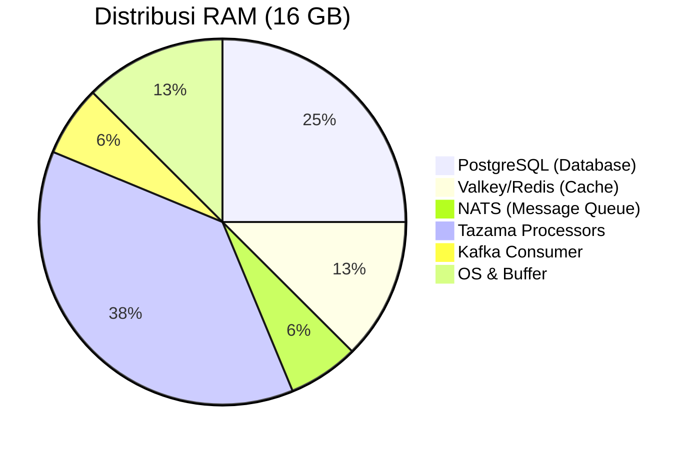

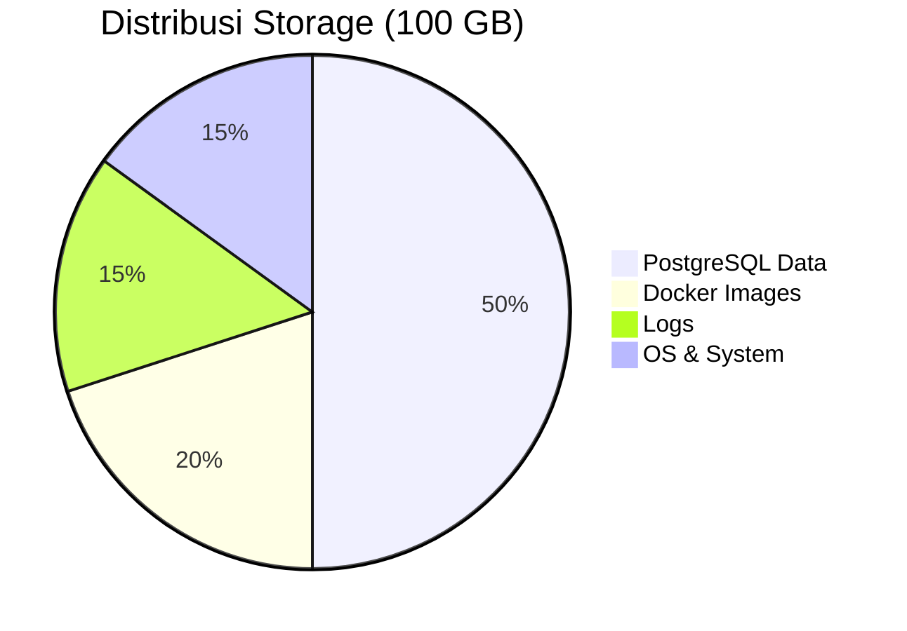

---

## 3. Sistem Operasi: RHEL 9

### 3.1 Kenapa RHEL 9?

| Alasan | Penjelasan |
|--------|------------|
| **Standar Perusahaan** | Sesuai dengan standar OS yang digunakan |
| **Support Enterprise** | Ada dukungan resmi dari Red Hat |
| **Keamanan** | SELinux built-in untuk keamanan tambahan |
| **Stabilitas** | Cocok untuk sistem production banking |
| **Compliance** | Memenuhi standar regulasi keuangan |

### 3.2 Software yang Perlu Diinstall

Setelah server ready, tim akan menginstall software berikut:

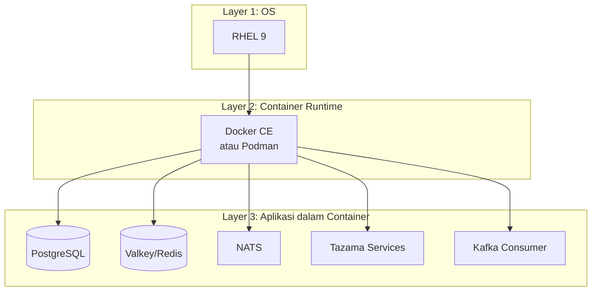

| Software | Versi | Fungsi | Diinstall oleh |
|----------|-------|--------|----------------|
| RHEL | 9.x | Sistem Operasi | Tim Infrastruktur |
| Docker CE / Podman | Latest | Container runtime | Tim Infrastruktur |
| Docker Compose | Latest | Orchestration | Tim Infrastruktur |
| PostgreSQL | 18 | Database (dalam container) | Tim Aplikasi |
| Valkey | 7.x | Cache (dalam container) | Tim Aplikasi |
| NATS | 2.x | Message queue (dalam container) | Tim Aplikasi |
| Tazama | 3.x | Fraud detection (dalam container) | Tim Aplikasi |

---

## 4. Kebutuhan Network

### 4.1 Konektivitas yang Diperlukan

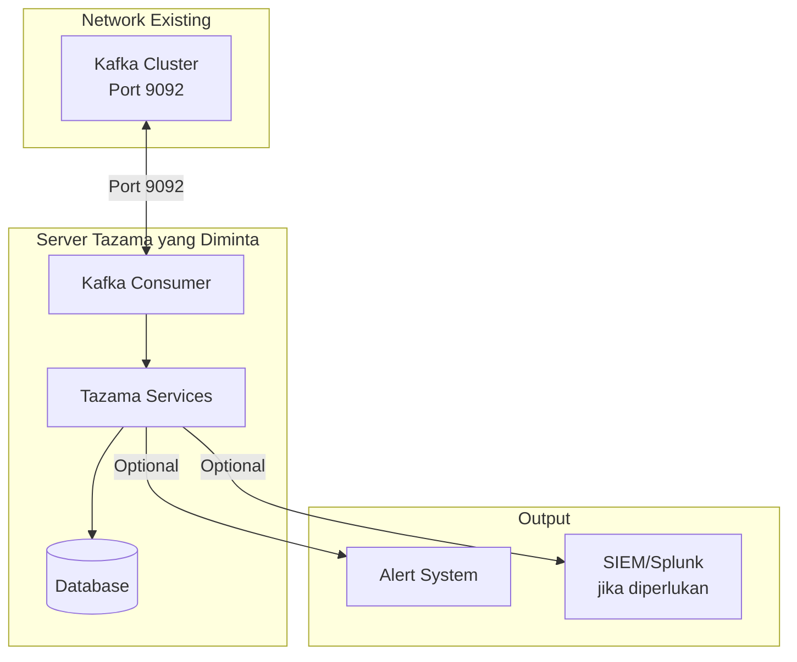

### 4.2 Port yang Perlu Dibuka

| Port | Protokol | Arah | Tujuan |
|------|----------|------|--------|
| **9092** | TCP | Outbound | Koneksi ke Kafka cluster |
| **5000** | TCP | Internal | Tazama API (dalam server) |
| **5432** | TCP | Internal | PostgreSQL (dalam server) |
| **6379** | TCP | Internal | Valkey/Redis (dalam server) |
| **4222** | TCP | Internal | NATS (dalam server) |
| **22** | TCP | Inbound | SSH untuk administrasi |

### 4.3 Firewall Rules yang Diperlukan

```
# Outbound ke Kafka (WAJIB)
Server Tazama → Kafka Cluster : Port 9092

# Inbound untuk administrasi
Admin Network → Server Tazama : Port 22 (SSH)

# Optional: Jika perlu akses dari luar
Load Balancer → Server Tazama : Port 5000 (API)
```

---

## 5. Kapasitas & Performa

### 5.1 Estimasi Kapasitas

Dengan spesifikasi yang diminta, server dapat menangani:

| Metrik | Kapasitas |
|--------|-----------|
| **Transaksi per detik (TPS)** | 100 - 500 TPS |
| **Transaksi per hari** | ~1 - 5 juta transaksi |
| **Data retention** | 90 hari (configurable) |
| **Response time** | < 100ms per transaksi |

### 5.2 Skenario Beban

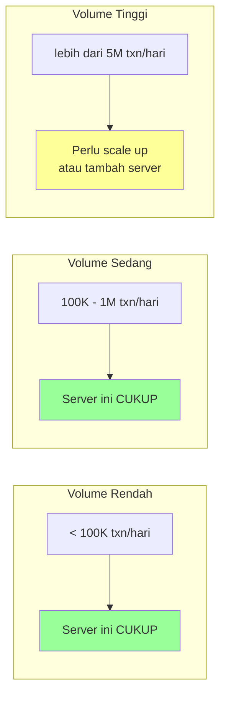

---

## 6. Timeline & Tahapan

### 6.1 Timeline Implementasi

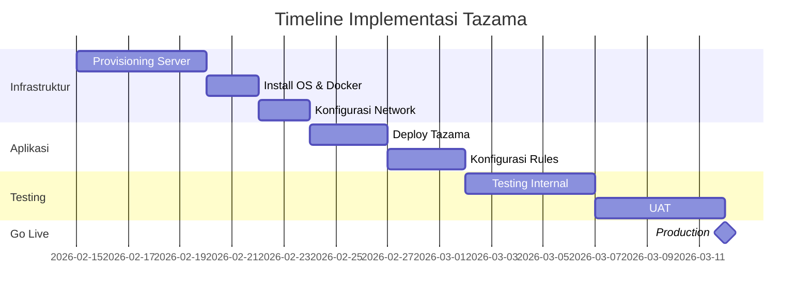

---

## 7. Pertimbangan Keamanan

### 7.1 Keamanan yang Sudah Built-in

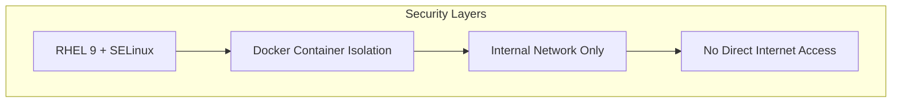

| Aspek | Implementasi |
|-------|--------------|
| **OS Security** | RHEL 9 dengan SELinux enabled |
| **Container Isolation** | Setiap komponen dalam container terpisah |
| **Network** | Hanya koneksi internal, tidak perlu internet |
| **Data** | Semua data tersimpan dalam server |
| **Access** | SSH dengan key-based authentication |

### 7.2 Data yang Diproses

| Jenis Data | Perlakuan |
|------------|-----------|
| Data transaksi | Diproses real-time, disimpan untuk audit |
| Hasil evaluasi | Disimpan di PostgreSQL internal |
| Alert | Dikirim ke sistem alert existing |

---

## 8. Ringkasan Permintaan

### 8.1 Opsi yang Tersedia

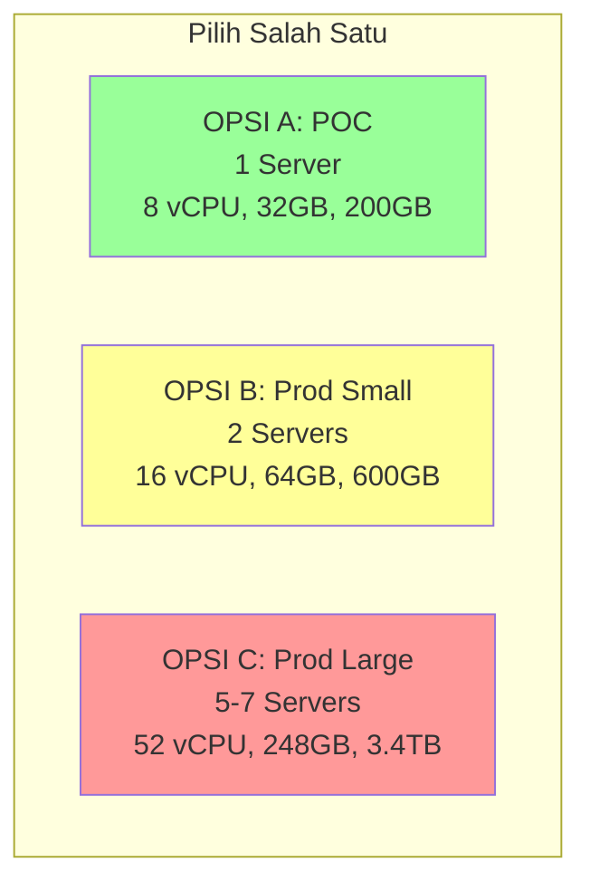

### 8.2 Checklist Permintaan - OPSI A (POC)

| No | Item | Spesifikasi | Status |
|----|------|-------------|--------|
| 1 | Server | 1x (8 vCPU, 32GB RAM, 200GB SSD) | ⏳ Pending |
| 2 | OS | RHEL 9.x | ⏳ Pending |
| 3 | Docker | Docker CE atau Podman + Compose | ⏳ Pending |
| 4 | Network | Akses ke Kafka (port 9092) | ⏳ Pending |
| 5 | Firewall | Port 9092 outbound, 22 inbound | ⏳ Pending |
| 6 | SSH Access | Key-based untuk tim aplikasi | ⏳ Pending |

### 8.3 Checklist Permintaan - OPSI B (Production Small)

| No | Item | Spesifikasi | Status |
|----|------|-------------|--------|
| 1 | Server App | 1x (8 vCPU, 32GB RAM, 100GB SSD) | ⏳ Pending |
| 2 | Server DB | 1x (8 vCPU, 32GB RAM, 500GB SSD) | ⏳ Pending |
| 3 | OS | RHEL 9.x (kedua server) | ⏳ Pending |
| 4 | Docker | Docker CE atau Podman + Compose | ⏳ Pending |
| 5 | Network Internal | Koneksi antar 2 server (low latency) | ⏳ Pending |
| 6 | Network External | Akses ke Kafka (port 9092) | ⏳ Pending |
| 7 | Firewall | Sesuai tabel port | ⏳ Pending |
| 8 | SSH Access | Key-based untuk tim aplikasi | ⏳ Pending |

### 8.4 Checklist Permintaan - OPSI C (Production Large)

| No | Item | Spesifikasi | Status |
|----|------|-------------|--------|
| 1 | App Servers | 3x (8 vCPU, 32GB RAM, 100GB SSD) | ⏳ Pending |
| 2 | DB Primary | 1x (8 vCPU, 64GB RAM, 1TB SSD) | ⏳ Pending |
| 3 | DB Replica | 1x (8 vCPU, 64GB RAM, 1TB SSD) | ⏳ Pending |
| 4 | Cache Servers | 2x (4 vCPU, 16GB RAM, 50GB SSD) | ⏳ Pending |
| 5 | Consumer Servers | 2x (4 vCPU, 8GB RAM, 50GB SSD) | ⏳ Pending |
| 6 | Load Balancer | 1x (atau gunakan existing) | ⏳ Pending |
| 7 | OS | RHEL 9.x (semua server) | ⏳ Pending |
| 8 | Docker | Docker CE atau Podman + Compose | ⏳ Pending |
| 9 | Network Internal | Private network antar server | ⏳ Pending |
| 10 | Network External | Akses ke Kafka (port 9092) | ⏳ Pending |
| 11 | Firewall | Sesuai tabel port | ⏳ Pending |
| 12 | SSH Access | Key-based untuk tim aplikasi | ⏳ Pending |

### 8.5 Tabel Ringkasan Semua Opsi

```
┌─────────────────────────────────────────────────────────────────────────────┐
│                        RINGKASAN SPESIFIKASI SERVER                          │
├─────────────────────────────────────────────────────────────────────────────┤
│                                                                              │
│  OPSI A - POC/PILOT (1 Server)                                              │
│  ├── Server    : 1 unit                                                     │
│  ├── CPU       : 8 vCPU                                                     │
│  ├── RAM       : 32 GB                                                      │
│  ├── Storage   : 200 GB SSD                                                 │
│  ├── OS        : RHEL 9                                                     │
│  └── Kapasitas : ~500 TPS / ~5 juta txn per hari                           │
│                                                                              │
├─────────────────────────────────────────────────────────────────────────────┤
│                                                                              │
│  OPSI B - PRODUCTION SMALL (2 Servers)                                      │
│  ├── Server 1 (App)  : 8 vCPU, 32 GB RAM, 100 GB SSD                       │
│  ├── Server 2 (DB)   : 8 vCPU, 32 GB RAM, 500 GB SSD                       │
│  ├── Total           : 16 vCPU, 64 GB RAM, 600 GB SSD                      │
│  ├── OS              : RHEL 9 (kedua server)                               │
│  └── Kapasitas       : ~2,000 TPS / ~20 juta txn per hari                  │
│                                                                              │
├─────────────────────────────────────────────────────────────────────────────┤
│                                                                              │
│  OPSI C - PRODUCTION LARGE (5-7 Servers)                                    │
│  ├── App Servers     : 3x (8 vCPU, 32 GB, 100 GB SSD)                      │
│  ├── DB Primary      : 1x (8 vCPU, 64 GB, 1 TB SSD)                        │
│  ├── DB Replica      : 1x (8 vCPU, 64 GB, 1 TB SSD)                        │
│  ├── Cache Servers   : 2x (4 vCPU, 16 GB, 50 GB SSD)                       │
│  ├── Consumer        : 2x (4 vCPU, 8 GB, 50 GB SSD)                        │
│  ├── Total           : 52 vCPU, 248 GB RAM, ~3.4 TB SSD                    │
│  ├── OS              : RHEL 9 (semua server)                               │
│  └── Kapasitas       : ~10,000 TPS / ~100 juta txn per hari                │
│                                                                              │
└─────────────────────────────────────────────────────────────────────────────┘
```

### 8.6 Yang Dibutuhkan dari Tim Infrastruktur

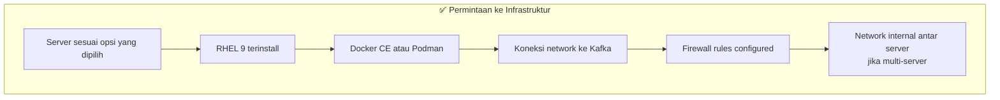

---

## 9. Kontak & Eskalasi

| Role | Nama | Untuk |
|------|------|-------|
| **Requestor** | [Nama Tim Aplikasi] | Pertanyaan teknis aplikasi |
| **Infrastruktur** | [Nama Tim Infra] | Provisioning & network |
| **Approval** | [Nama Manager] | Approval resource |

---

## 10. Lampiran

### 10.1 Arsitektur Sistem Lengkap

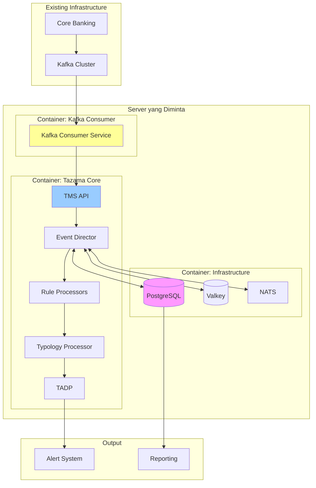

### 10.2 Referensi

- Tazama Official: https://github.com/tazama-lf
- RHEL 9 Documentation: https://access.redhat.com/documentation/en-us/red_hat_enterprise_linux/9
- Docker on RHEL: https://docs.docker.com/engine/install/rhel/

---

**Dokumen ini dibuat untuk keperluan permintaan infrastruktur.**  
**Versi: 1.0 | Tanggal: Februari 2026**
