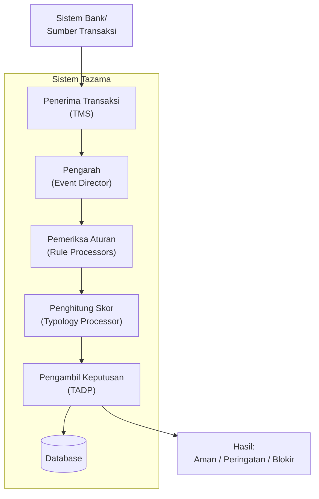
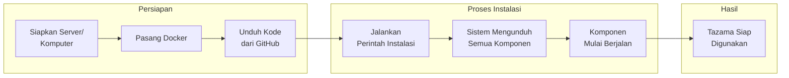
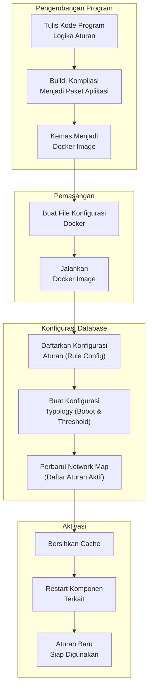
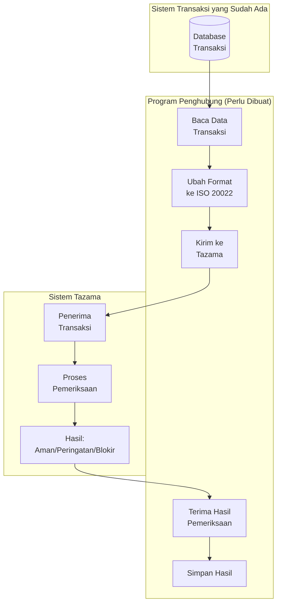
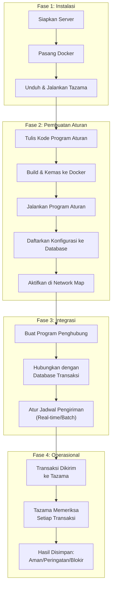
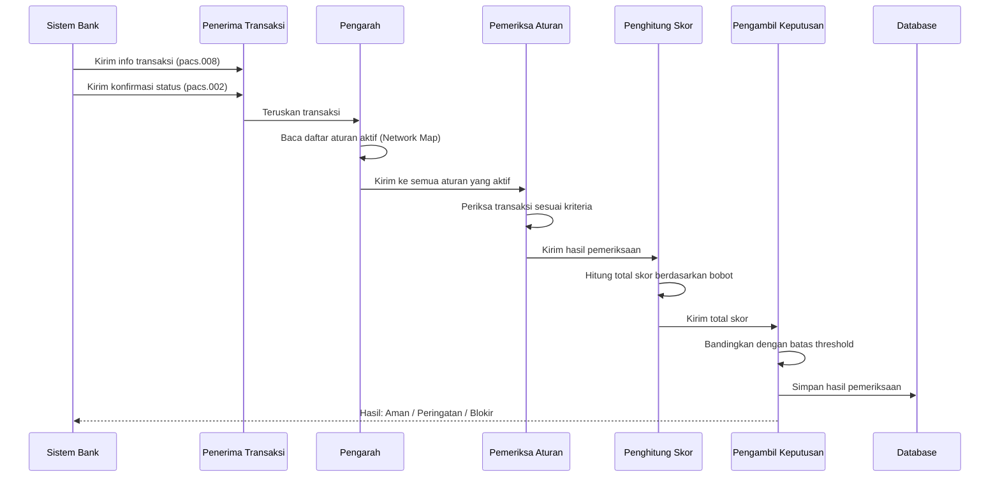

# Panduan Penggunaan Tazama
## Sistem Deteksi Transaksi Mencurigakan

---

## Gambaran Umum Sistem

Tazama adalah sistem untuk memeriksa transaksi keuangan secara otomatis dan mendeteksi transaksi yang mencurigakan. Sistem ini terdiri dari banyak komponen yang saling terhubung dan bekerja sama untuk memproses setiap transaksi yang masuk.

---

## Tahap 1: Instalasi Sistem

Pertama, kita perlu mengunduh kode program Tazama dari GitHub dan memasangnya di komputer atau server. Tazama bukan aplikasi tunggal, melainkan kumpulan dari banyak komponen yang saling terhubung. Ada komponen untuk menerima transaksi, komponen untuk memproses aturan, komponen untuk menghitung skor, komponen database, komponen antrian pesan, dan lain-lain. Semua komponen ini dijalankan menggunakan Docker, yaitu aplikasi yang berfungsi sebagai wadah untuk menjalankan banyak program sekaligus secara terisolasi.

Setelah Docker terpasang dan kita menjalankan perintah instalasi, sistem akan mengunduh dan menjalankan sekitar 10-15 komponen yang berbeda. Proses ini memakan waktu sekitar 10-30 menit tergantung kecepatan internet dan spesifikasi komputer. Setelah selesai, semua komponen Tazama sudah berjalan dan siap menerima transaksi untuk diperiksa.

---

## Tahap 2: Membuat Aturan Deteksi (Rule)

Tazama sudah menyediakan beberapa aturan bawaan, tapi kalau kita ingin membuat aturan baru sesuai kebutuhan, prosesnya cukup panjang dan melibatkan beberapa langkah.

### Alur Pembuatan Aturan Baru

### Penjelasan Setiap Langkah

**Pertama, kita perlu menulis kode program untuk logika aturannya.** Misalnya kita ingin membuat aturan untuk mendeteksi transaksi nominal besar. Kita harus menulis program yang membaca nilai transaksi, lalu menentukan kategorinya berdasarkan besaran nominal. Program ini ditulis menggunakan bahasa pemrograman TypeScript, dan harus mengikuti format dan struktur yang sudah ditentukan oleh Tazama supaya bisa terhubung dengan komponen lainnya.

**Kedua, setelah kode program selesai ditulis, kita perlu mengubahnya menjadi paket aplikasi yang bisa dijalankan.** Proses ini disebut build, dimana kode yang kita tulis dikompilasi dan dikemas menjadi bentuk yang siap dijalankan oleh komputer.

**Ketiga, paket aplikasi tadi perlu dikemas lagi menjadi Docker image.** Docker image ini seperti "kotak" yang berisi program aturan kita beserta semua yang dibutuhkan untuk menjalankannya. Dengan dikemas dalam Docker image, program aturan kita bisa dijalankan bersama komponen Tazama lainnya.

**Keempat, kita perlu membuat file konfigurasi untuk menjalankan Docker image tadi.** File ini berisi pengaturan seperti nama aturan, koneksi ke database, koneksi ke sistem antrian pesan, dan pengaturan lainnya yang diperlukan supaya program aturan kita bisa berkomunikasi dengan komponen Tazama lainnya.

**Kelima, setelah program aturan berjalan, kita perlu mendaftarkan konfigurasi aturannya ke database.** Di sini kita tentukan kriteria pemeriksaannya, misalnya transaksi di bawah 1 juta masuk kategori pertama, 1-5 juta kategori kedua, dan seterusnya. Konfigurasi ini yang akan dibaca oleh program aturan saat memeriksa transaksi.

**Keenam, kita perlu membuat konfigurasi Typology.** Typology ini menentukan bobot dari setiap kategori hasil pemeriksaan. Misalnya kategori pertama bobotnya 0, kategori kedua bobotnya 100, kategori ketiga bobotnya 300. Typology juga menentukan batas kapan sistem memberi peringatan dan kapan memblokir transaksi.

**Ketujuh, kita perlu memperbarui Network Map.** Network Map ini seperti daftar aturan mana saja yang aktif dan harus dijalankan saat ada transaksi masuk. Kalau aturan baru kita tidak didaftarkan di Network Map, maka aturan tersebut tidak akan dijalankan meskipun programnya sudah berjalan.

**Terakhir, setelah semua konfigurasi dimasukkan, kita perlu membersihkan cache sistem dan me-restart beberapa komponen** supaya konfigurasi baru terbaca oleh sistem.

---

## Tahap 3: Menghubungkan dengan Data Transaksi

Tazama tidak secara otomatis membaca dari database transaksi yang sudah ada. Tazama bekerja dengan cara menerima data transaksi yang dikirimkan kepadanya, memprosesnya, lalu memberikan hasil pemeriksaan.

### Alur Integrasi dengan Sistem yang Sudah Ada

### Penjelasan Proses Integrasi

**Untuk menghubungkan sistem transaksi yang sudah ada dengan Tazama, kita perlu membuat program penghubung.** Program ini tugasnya mengambil data transaksi dari sistem kita, mengubah formatnya menjadi format ISO 20022 yang dipahami oleh Tazama, mengirimkannya ke Tazama, lalu menerima dan menyimpan hasilnya.

Format ISO 20022 ini adalah standar internasional untuk pesan keuangan. Tazama menggunakan dua jenis pesan: pacs.008 untuk informasi transaksi (siapa pengirim, siapa penerima, berapa nominal, kapan waktunya), dan pacs.002 untuk konfirmasi status transaksi (apakah berhasil atau gagal). Kedua pesan ini harus dikirimkan secara berurutan untuk setiap transaksi yang ingin diperiksa.

**Program penghubung ini bisa dibuat untuk berjalan secara real-time atau batch.** Kalau real-time, setiap ada transaksi baru langsung dikirim ke Tazama untuk diperiksa. Kalau batch, transaksi dikumpulkan dulu dalam periode tertentu, baru dikirim sekaligus ke Tazama.

**Setelah Tazama selesai memeriksa, hasilnya bisa diambil dari database Tazama** atau langsung dari response saat mengirim transaksi. Hasil ini berisi status apakah transaksi aman, perlu ditinjau, atau harus diblokir, beserta detail skor dari setiap aturan yang dijalankan.

---

## Alur Lengkap: Dari Instalasi Sampai Penggunaan

---

## Alur Pemrosesan Transaksi di Dalam Tazama

Ketika sebuah transaksi dikirim ke Tazama, berikut adalah proses yang terjadi di dalam sistem:

---

## Ringkasan

| Tahap | Kegiatan | Estimasi Waktu |
|-------|----------|----------------|
| **Instalasi** | Siapkan server, pasang Docker, unduh dan jalankan Tazama | 1-2 jam |
| **Membuat Aturan Baru** | Tulis kode, build, deploy, konfigurasi database, aktivasi | 1-3 hari per aturan |
| **Integrasi** | Buat program penghubung, hubungkan dengan sistem transaksi | 1-2 minggu |
| **Operasional** | Sistem berjalan otomatis memeriksa transaksi | Berkelanjutan |

---

## Catatan Penting

1. **Tazama membutuhkan tim teknis** untuk instalasi, pembuatan aturan, dan integrasi dengan sistem yang sudah ada.

2. **Setiap aturan baru memerlukan pengembangan program**, bukan hanya konfigurasi. Ini membutuhkan programmer yang memahami TypeScript dan arsitektur Tazama.

3. **Integrasi dengan sistem transaksi yang sudah ada memerlukan program penghubung** yang harus dibuat khusus sesuai dengan struktur data dan sistem yang digunakan.

4. **Format data harus diubah ke ISO 20022** sebelum dikirim ke Tazama. Ini adalah standar internasional yang digunakan Tazama untuk memahami data transaksi.

5. **Hasil pemeriksaan perlu ditindaklanjuti** oleh tim operasional untuk transaksi yang mendapat status peringatan atau blokir.
