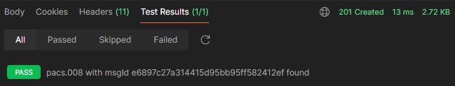
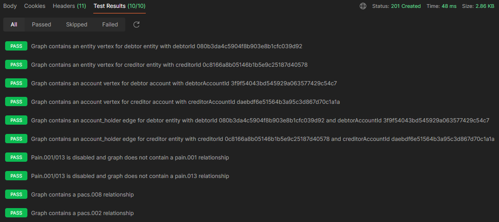
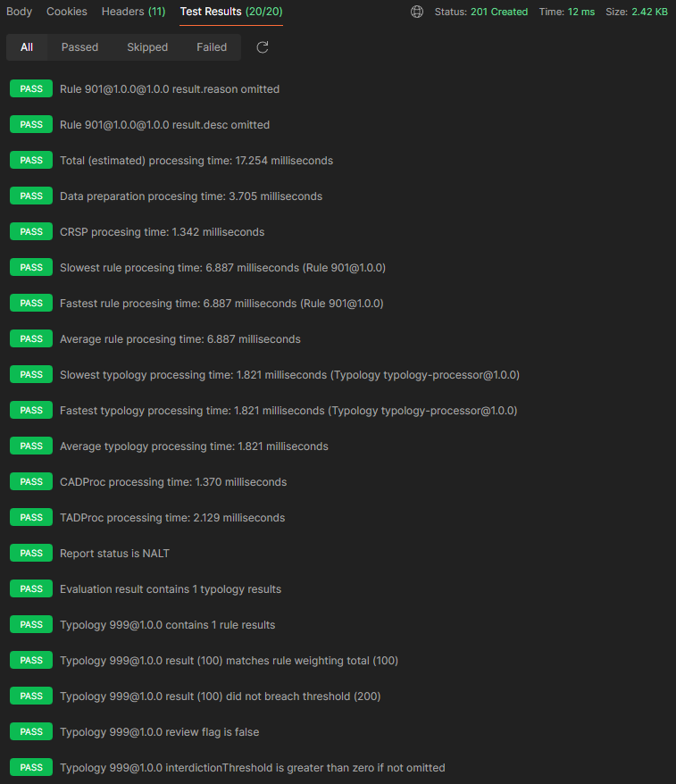
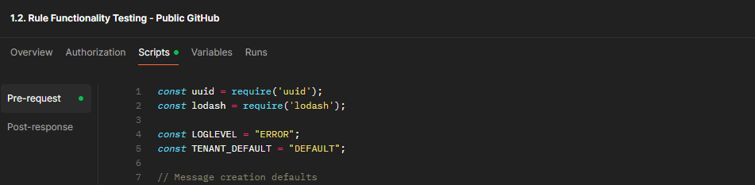

<!-- SPDX-License-Identifier: Apache-2.0 -->

## Table of Contents

1. [Introduction](#introduction)
2. [The folders](#the-folders)
   1. [environments](#environments)
3. [The files](#the-files)
   1. [1. Public (GitHub)](#1-public-github)
   2. [2. Public (DockerHub)](#2-public-dockerhub)
   3. [3. Full-service (DockerHub)](#3-full-service-dockerhub)
   4. [4. Multi-Tenant Public (DockerHub)](#4-multi-tenant-public-dockerhub)
4. [Creating messages in Memory](#creating-messages-in-memory)
   1. [Linking the utility library](#linking-the-utility-library)
   2. [Clearing previously created messages](#clearing-previously-created-messages)
   3. [Creating a new message set in memory](#creating-a-new-message-set-in-memory)
5. [Rule Functionality Testing](#rule-functionality-testing)
   1. [Linking the utility library](#linking-the-utility-library-1)
   2. [Identifying the rule processor](#identifying-the-rule-processor)
   3. [Set up the test transaction message set](#set-up-the-test-transaction-message-set)
   4. [Set up the remaining request body variables](#set-up-the-remaining-request-body-variables)
6. [The Tazama test `utils` library for Postman](#the-tazama-test-utils-library-for-postman)
7. [Tazama regression testing checklist](#tazama-regression-testing-checklist)
   1. [Option 1. Public (GitHub)](#option-1-public-github)
   2. [Option 2. Public (DockerHub)](#option-2-public-dockerhub)
   3. [Option 3. Full-service (DockerHub)](#option-3-full-service-dockerhub)
   4. [Option 4. Multi-Tenant Public (DockerHub)](#option-4-multi-tenant-public-dockerhub)

## Introduction

Tazama is prefaced with the Transaction Monitoring Service (TMS) and Admin Service APIs which makes [Postman](https://www.postman.com/) a useful tool to test platform functionality. In days gone by, Tazama was also composed out of a series of forward-chaining microservices that all had their own RESTful interfaces to receive incoming requests, but we have since replaced our inter-services communication protocol with [NATS](http://nats.io) that connects all our internal processors via its pub/sub interface. While we still use Postman to test the internal processors, we now have to access the NATS pub/sub interface via a NATS REST Proxy that we also built. (You can read more about the NATS REST proxy in the [nats-utilities](https://github.com/tazama-lf/nats-utilities/tree/main)) repository.

The files and folders you see here can be used to test Tazama via  the TMS API, the Admin Service API and, as an example, rule processor 901, our sample template rule processor.

When you are deploying Tazama as a public user<sup>1</sup> you will be able to use the tests here to validate your deployment. The instructions to set up Tazama via Docker Compose into a Full Stack containerized implementation can be found in the [Full-Stack-Docker-Tazama](https://github.com/tazamma-lf/Full-Stack-Docker-Tazama/tree/main) repository. The instructions there will provide specific guidance on how to test a deployment using the end-to-end test above.

To use any of these tests, you can clone this repository onto your local machine and either import the tests you want to run or work on into Postman, or you can run the tests from a command line via [Newman CLI](https://learning.postman.com/docs/collections/using-newman-cli/installing-running-newman/#installing-newman).

Read on for some more information on the tests, and also guidance on how to write tests for your own processors.

## The folders

### environments

If you're familiar with Postman then you will know that Postman tests are often executed within a specific environment configuration. Any environment variables that we use in our tests are defined in a number of environment files. The environment folder contains the environment file that we use for all our testing and development purposes. If you are deploying Tazama into your own cloud environment, and you would like to create a Postman environment file that matches your deployed environment, you can modify this environment file for your needs.

> [!NOTE]
> 
> Postman allows for three kinds of variables: there are environment variables, global variables, and collection variables. Tazama doesn't currently use collection variables. When you click the little icon in the top right in Postman, you'll get to see the two types Tazama uses in two separate tables.
>
>As a rule in Tazama, the environment variables are just that: variables that define the parameters for running the Postman tests in a specific deployed environment. These variables should be static and persistent between tests. No Tazama Postman test (pre-request script or test) should ever use the `pm.environment.set()` method.
>
> The global variables are the ones that should be used when you are stashing values between tests. For example, if you want to set up the address to the API, it's an environment variable. If you want to remember an entity or account identifier from one test's output to use as input into another test, it's a global variable.

#### Tazama-Docker-Compose.postman_environment.json

This environment will facilitate testing over the containerized Tazama that is deployed from the [Full-Stack-Docker-Tazama](https://github.com/frmscoe/Full-Stack-Docker-Tazama) repository. The environment is set up based on the default settings of the deployment.

#### Tazama environment file contents

A functioning Tazama environment file for Postman will contain the following attributes. These attributes are used in our tests and allow us to make changes to the values via the environment file, instead of having to edit the scripts directly.

**General attributes:**

| Attribute(s) | Description | Example(s)
|:---:|---|---|
| `tazamaTMSUrl` | The URL of the Tazama TMS API| localhost:5000 </br> https://tazama-tms.yourcompany.com:5000 |
| `tazamaTMSContainerUrl` | The name of the Tazama TMS API Docker container that is used to retrieve test results via the NATS Utilities | tazama-tms-1:3000 |
| `tazamaAdminUrl` | The URL of the Tazama Administrative API | localhost:5100 </br> https://tazama-admin.yourcompany.com:5100 |
| `tazamaAuthUrl` | The URL of the Tazama Authentication Service API | localhost:5020 </br> https://tazama-auth.yourcompany.com:5020 |
| `natsUrl` | The URL of the NATS REST proxy for testing a specific processor directly. | localhost:4000 </br> https://tazama-tms.yourcompany.com:4000 |
| `postgresUrl` | The URL of the deployed instance of PostgreSQL | localhost:15432 </br> https://tazama-postgresql.yourcompany.com:15432 |
| `postgresUsername` | The password for accessing PostgreSQL - not currently used since API services are provided by Hasura | <keep-it-secret-keep-it-safe> |
| `postgresPassword` | The password for accessing PostgreSQL - not currently used since API services are provided by Hasura | <keep-it-secret-keep-it-safe> |
| `hasuraUrl` | The URL of the deployed instance of Hasura, used to provide API services for PostgreSQL during testing | localhost:6100 |
| `hasuraPassword` | The secret for accessing administrative and non-anonymous Hasura services | <keep-it-secret-keep-it-safe> |
| `keycloakUrl` | The URL of the deployed instance of KeyCloak | localhost:8080 </br> https://tazama-keycloak.yourcompany.com:8080 |
| `activePain001` | This attribute reflects whether the platform has been configured to include or exclude a quoting phase via pain.001 and pain.013 messages as part of a transaction set | `true` - quoting is included</br> `false` - quoting is excluded |
| `path-tms-api-version` | The API path element for the current version of the TMS API. Do not update this value unless the API version in your deployment is different. | `/v1` |
| `path-admin-api-version` | The API path element for the current version of the Admin Service API. Do not update this value unless the API version in your deployment is different. | `/v1` |
| `path-auth-api-version` | The API path element for the current version of the Authentication Service API. Do not update this value unless the API version in your deployment is different. | `/v1` |
| `path-pain001` | The API path to receive a pain.001 request. Do not update this value unless the paths in your deployment are different. | `evaluate/iso20022/pain.001.001.11` |
| `path-pain013` | The API path to receive a pain.013 request. Do not update this value unless the paths in your deployment are different. | `evaluate/iso20022/pain.013.001.09` |
| `path-pacs008` | The API path to receive a pacs.008 request. Do not update this value unless the paths in your deployment are different. | `evaluate/iso20022/pacs.008.001.10` |
| `path-pacs002` | The API path to receive a pacs.002 request. Do not update this value unless the paths in your deployment are different. | `evaluate/iso20022/pacs.002.001.12` |
| `path-account-condition` | The API path to receive a request to manage conditions for an account. Do not update this value unless the paths in your deployment are different. | `admin/event-flow-control/account` |
| `path-entity-condition` | The API path to receive a request to manage conditions for an entity. Do not update this value unless the paths in your deployment are different. | `admin/event-flow-control/entity` |

**NATS REST proxy-specific attributes:**

The attributes below are only required if you are interacting with a specific processor directly via the NATS REST proxy. The variables here are a hangover from when the processors were invoked directly through their native RESTful APIs. With the update to NATS, the internal processors can only be accessed directly via the NATS REST proxy, and for that reason the folder path must be "natsPublish".

| Attribute(s) | Description | Example(s)
|:---:|---|---|
| `path-event-director` | The folder path to the Channel Router & Setup Processor | natsPublish - no processors behind the TMS APR are REST-accessible; internal processors can only be accessed directly through the [NATS Utilities](https://github.com/frmscoe/nats-utilities) |
| `path-rule-001-rel-1-0-0` </br> to </br> `path-rule-901-rel-1-0-0` | The folder/path to the specific rule processor | natsPublish |
| `path-typology-processor` | The folder/path to the typology processor | natsPublish |
| `path-tadproc` | The folder/path to the Transaction Aggregation & Decisioning processor | natsPublish |
| `path-cms-service` | The folder/path to the Case Management egress service via NATS. This value should not be changed unless your deployment has an alternative destination configured for the CMS service. | `off-cms-service` |

**PostgreSQL-specific attributes:**

The attributes below host a variety of PostgreSQL variables for database and database tables to provide some abstraction in the code. In general, these values only need to change if the underlying database structure changes.

| Attribute(s) | Description | Example(s)
|:---:|---|---|
| `db_raw_history` | The database where the transaction history is stored | `raw_history` |
| `db_event_history` | The database where the transaction history data model is stored | `event_history` |
| `db_evaluation` | The database where the transaction evaluation results is stored | `evaluation` |
| `db_raw_history_pain001` | The database table where the pain.001 transaction history is stored in the message history database | `pain001` |
| `db_raw_history_pain013` | The database table where the pain.013 transaction history is stored in the message history database | `pain013` |
| `db_raw_history_pacs008` | The database table where the pacs.008 transaction history is stored in the message history database | `pacs008` |
| `db_raw_history_pacs002` | The database table where the pacs.002 transaction history is stored in the message history database | `pacs002` |
| `db_event_history_entity` | The database table where the debtor and creditor information in a transaction is stored in the transaction history graph database | `entity` |
| `db_event_history_account_holder` | The edge database table where the debtor and creditor account relationship information is stored in the transaction history graph database | `account_holder` |
| `db_event_history_account` | The database table where the debtor and creditor account information in a transaction is stored in the transaction history graph database | `account` |
| `db_event_history_transaction` | The database table where the debtor and creditor information in a transaction is stored in the transaction history graph database | `transaction` |
| `db_event_history_condition` | The database table where the condition information that governs transation blocking resides | `condition` |
| `db_event_history_governed_as_debtor_by` | The database table where the condition information that governs transation blocking by debtors resides | `governed_as_debtor_by` |
| `db_event_history_governed_as_debtor_account_by` | The database table where the condition information that governs transation blocking by debtor accounts resides | `governed_as_debtor_account_by` |
| `db_event_history_governed_as_creditor_by` | The database table where the condition information that governs transation blocking by creditors resides | `governed_as_creditor_by` |
| `db_event_history_governed_as_creditor_account_by` | The database table where the condition information that governs transation blocking by creditor accounts resides | `governed_as_creditor_account_by` |
| `db_configuration_all` | The database where processor configuration data is stored | `configuration` |
| `db_configuration_route` | The database where routing configuration data is stored | `network_map` |
| `db_configuration_rules` | The database table where the rule configurations will be stored in the processor configuration database | `rule` |
| `db_configuration_typologies` | The database table where the typology configurations will be stored in the processor configuration database | `typology` |

## The files

The test collections in this repository are organized to match the different setup options available in the Tazama Docker Compose deployment:

#### 1. Public (GitHub)

**1.1. (NO-AUTH) Public GitHub End-to-End Test.postman_collection.json**

This test collection contains a collection of API requests that set up a randomly generated set of pacs.008 and pacs.002 transactions, then submits the transaction pair to the TMS API, and finally performs a number of tests to make sure that the databases were properly updated and the transaction evaluated successfully to the point where a result was posted to the results database. This test accommodates a deployment out of GitHub that only includes the default Rule-901-based rule executer.

**1.2. Rule Functionality Testing - Public GitHub.postman_collection.json**

**0.2. Condition Management - All.postman_collection.json**

_With authentication services enabled:_

**0.1. Authentication Services - All.postman_collection.json**

#### 2. Public (DockerHub)

**2.1. (NO-AUTH) Public DockerHub End-to-End Test.postman_collection.json**

This test collection contains a collection of API requests that set up a randomly generated set of pacs.008 and pacs.002 transactions, then submits the transaction pair to the TMS API, and finally performs a number of tests to make sure that the databases were properly updated and the transaction evaluated successfully to the point where a result was posted to the results database. This test accommodates a deployment out of Docker Hub that includes both the Rule-901 and Rule-902 rule processors.

**2.2. Rule Functionality Testing - Public DockerHub.postman_collection.json**

**0.2. Condition Management - All.postman_collection.json**

_With authentication services enabled:_

**0.1. Authentication Services - All.postman_collection.json**

#### 3. Full-service (DockerHub)

**3.1. (NO-AUTH) Public DockerHub Full-Service Test.postman_collection.json**

This test collection contains a collection of API requests that set up a randomly generated set of pacs.008 and pacs.002 transactions, then submits the transaction pair to the TMS API, and finally performs a number of tests to make sure that the databases were properly updated and the transaction evaluated successfully to the point where a result was posted to the results database. This test accommodates a deployment out of Docker Hub that includes all available Tazama rule processors with non-descript configurations and composed into a single generic typology.

#### 4. Multi-Tenant Public (DockerHub)

The following two test collections contains a collection of API requests that first attempts to perform unauthenticated API requests, then authenticates a user for either tenant-001 or tenant-002, and then resubmits the messages to the TMS API. The test collections conclude with a number of tests to make sure that the messages were properly segregated by the individual tenant domains, the databases were properly updated and the transaction evaluated successfully to the point where a result was posted to the results database.

4.1. (AUTH) Public GitHub End-to-End test - tenant-001.postman_collection.json

4.2. (AUTH) Public GitHub End-to-End test - tenant-002.postman_collection.json

You can view the [Tazama regression testing checklist](#tazama-regression-testing-checklist) section at the bottom of this document for a detailed guide on how to set up Tazama to support the execution of specific test collections.

Tazama has created a Javascript utility library (found in each collection's Global Pre-Request Script tab) to assist with the creation of valid pain.001, pain.013, pacs.008 and pacs.002 messages, one-by-one or in bulk. You can find the documentation for this utility further down in this page, or you can view the docstrings for each of the functions in the code in the test collection's Pre-Request Script tab.

The paragraphs below will provide a brief overview of some of the typical requests and tests in the test collections in this repository.

**Folder: Message creation sans pain.001/013**

 - Create messages in memory

    This request uses the Javascript utility library to create a pacs.008 message and a pacs.002 message. The messages in the set are linked via a common `EndToEndId` identifier.

    The complete messages, along with some specific attributes that we will be using in later requests, are stashed as global variables in Postman. You can also view the created information in the console when the request is executed.
    
    The default behaviour of the platform is to exclude the quoting steps via the `activePain001` environment variable and no pain.001/013 message will be created in this test.

    The message creation request is set up as a Postman test using a GET method and simultaneously checks that the TMS API is available. The TMS API will respond with: 
    ```json
    {
      "status": "UP"
    }
    ```

 - Post pacs.008 to TMS API - unauthenticated

    The pacs.008 message is sent to the TMS API. The TMS API validates the incoming message and updates the database with the pacs.008 data. If the database update is successful, the message is routed to the Event Director and a response is generated by the API confirming that the message was successfully received.
    
    This response is not the result of the evaluation though, but only the successful receipt and ingestion of the message. The platform still has to do all the work to evaluate the message and the evaluation result will be posted to the results database once the evaluation is complete. The TMS API should respond with:

    ```json
    {
      "message": "Transaction is valid",
      "data": {
        "TxTp": "pacs.008.001.10",
        <a copy of the incoming message>
    }
    ```
    This test will POST a message to the API without authentication. If this test is sumitted with authentication services enabled then the response will be:
    ```json
    {
      "error": "Unauthorized"
    }
    ```

    There are also authenticated versions of this test to support a deployment of the authentication services.

 - Post pacs.002 to TMS API - unauthenticated

    The pacs.002 message is sent to the TMS API. The TMS API validates the incoming message and updates the database with the pacs.002 data. If the database update is successful, the message is routed to the Event Director and a response is generated by the API confirming that the message was successfully received.
    
    As with the pacs.008 above, this response is not the result of the evaluation, but only the successful receipt and ingestion of the message. The platform still has to do all the work to evaluate the message and the evaluation result will be posted to the results database once the evaluation is complete. The TMS API should respond with:

    ```json
    {
      "message": "Transaction is valid",
      "data": {
        "TxTp": "pacs.002.001.12",
        <a copy of the incoming message>
    }
    ```
    This test will POST a message to the API without authentication. If this test is sumitted with authentication services enabled then the response will be:
    ```json
    {
      "error": "Unauthorized"
    }
    ```

    There are also authenticated versions of this test to support a deployment of the authentication services.

When authentication services are deployed, the following tests will be required to authenticate the user before being able to send any messages to the APIs.

 - Fetch Access Token

    A username and password is sent to KeyCloak to retrieve a KeyCloak JWT access token that can be used to access the API securely. The request should respond with the token and the response should contain the following attributes:
    ```json
    {
      "access_token": "<access_token_redacted>",
      "expires_in": 60,
      "refresh_expires_in": 1800,
      "refresh_token": "<bearer_token_redacted>",
      "token_type": "Bearer",
      "not-before-policy": 0,
      "session_state": "132b7181-cac4-4f3a-af78-63ddfe4d6371",
      "scope": "profile email"
    }
    ```

 - Fetch Authorization Token

    A username and password is sent to the Tazama Authentication Service API to retrieve a Tazama JWT that can be used to access the API securely. The request should respond with the token:
    ```json
      authentication_token_redacted
    ```

 - Post pacs.008 to TMS API - Authenticated

    The pacs.008 message is sent to the TMS API using the JWT token previously acquired. The TMS API validates the incoming message and updates the database with the pacs.008 data. The TMS API should respond with:

    ```json
    {
      "message": "Transaction is valid",
      "data": {
        "TxTp": "pacs.008.001.10",
        <a copy of the incoming message>
    }
    ```

 - Post pacs.002 to TMS API - Authenticated

    The pacs.002 message is sent to the TMS API using the JWT token previous acquired. The TMS API validates the incoming message and updates the database with the pacs.002 data. The TMS API should respond with:

    ```json
    {
      "message": "Transaction is valid",
      "data": {
        "TxTp": "pacs.002.001.12",
        <a copy of the incoming message>
    }
    ```

**Folder: DB update tests**

The tests in this folder interrogates the PostgreSQL database via the Hasura API to make sure that the datebase tables were correctly updated when the message was received and that the transaction evaluation completed successfully.

 - Fetch created pacs.008 from raw_history.pacs008

    This request checks if the pacs.008 message we had submitted was successfully written to the `pain008` table in the `transaction` database. The request attempts to retrieve the pacs.008 message via the `msgId` that we had used when we created the messages in memory. The response body will contain the retrieved message and the Test Results tab should show the successful result of the test assertion:

    

 - Fetch created pacs.002 from raw_history.pacs002

    This request checks if the pacs.002 message we had submitted was successfully written to the `raw_history.pacs002` table in the `transaction` database. The request attempts to retrieve the pacs.002 message via the `msgId` that we had used when we created the messages in memory. The response body will contain the retrieved message and the Test Results tab should show the successful result of the test assertion:

    

 - Check event data creation

    This request checks if all the event database components of the incoming message were properly created in the `event_history` database. The response body will contain the retrieved records across all tables and the Test Results tab should show the successful result of the test assertions:

    

 - Fetch evaluation results with msgId - Rule 901 Network Map Only

    This final test checks that the evaluation result was successfully produced by the system and safely stored in the `transaction` table in the `evaluation` database. The request is submitted to the `getreportbymsgid` endpoint in the Tazama Admin Service API. The response body will contain the retrieved evaluation result and the Test Results tab should show the successful result of the test assertions:

    

### Creating messages in Memory

At the start of most test collections, we create a new and unique set of messages in memory (as stashed global variables), so that the messages can be sent into the platform via the TMS API one by one. These messages are created and stashed through a function in the `utils` library in the global Pre-Request Script tab in each test collection.

#### Linking the utility library

To be able to easily use re-usable functions in Postman such as the ones in the utility library, we have to let the utility library know which Postman environment the utility functions are aimed at. To achieve this, we pass the Postman `pm` object to the utility library as the first step in the test's local Pre-request Script with the following statement:

```js
utils.setPm(pm);
```

The utility library maps the Postman `pm` object to an internal `_pm` object to allow the utility library to interact with the test's `pm` object. If this statement is missing, the test will fail with an error message such as:

```
There was an error in evaluating the Pre-request Script:TypeError: Cannot read properties of null (reading 'environment')
```

#### Clearing previously created messages

The next set of instructions are aimed resetting the data perhaps already in memory, just to make sure that we don't produce any unexpected results:

```js
pm.globals.unset("dataCache");
pm.globals.unset("endToEndId");
pm.globals.unset("messageIdPain001");
pm.globals.unset("messageIdPain013");
pm.globals.unset("messageIdPacs008");
pm.globals.unset("messageIdPacs002");
pm.globals.unset("pain001");
pm.globals.unset("pain013");
pm.globals.unset("pacs008");
pm.globals.unset("pacs002");
```

The statements above will clear specific global variables, but you can also clear all global variables with the follwing instruction:

```js
pm.globals.clear();
```

#### Creating a new message set in memory

The primary purpose of the `utils` function is to help testers to create valid incoming ISO20022 message sets to help facilitate the tests they are trying to perform.

Unfortunately Postman will not render a function's DocString in the test's Pre-Request Script tab, and you'll have to view the function in the `utils` library directly. To view the `utils` library, you have to open the Pre-Request Script tab in the global parent test collection folder:



You can browse or search the utils library to find the DocString for any function:

```js
/**
 * Converts a time unit to its equivalent in milliseconds.
 * 
 * Example: `weekInMilliseconds = 7 * utils.timeframe('d');`
 *
 * @param {string} unit - The time unit to convert. Supported units are 'd'/'days', 'h'/'hours', 'm'/'minutes', and 's'/'seconds'.
 * @returns {number} The number of milliseconds corresponding to the given time unit.
 */

timeframe: function (unit) {...}
```

The `utils` library contains a number of different functions to create test messages. One of these functions is the `createTransactionSetInMemory()` function, which can be invoked simply as follows:

```js
createdMessageSet = utils.createNewTransactionSetInMemory();
```

This function will create a new transaction set containing pain.001, pain.013, pacs.008 and pacs.002 messages linked via a new and unique common `EndToEndId` identifier. The debtor, creditor and debtor and creditor account identifiers will also be newly generated and unique. The transaction set will contain a randomly generated amount for the "XTS" test currency between 10 and 1000. The remaining mandatory values of the ISO20022 messages will be defaulted to specific values.

The result of the message creation is stashed in a variety of Postman global variables, for later retrieval, but is also returned from the utility function as an object and the individual created messages can be accessed as follows:

```js
createPacs008 = createdMessageSet.pacs008;
createPacs002 = createdMessageSet.pacs002;
```

> [!NOTE]
>
> The pain.001 and pain.013 messages will only be created if the Postman environment variable `activepain001` is set to `true`.

Another way of writing the `createTransactionSetInMemory()` function is a little more verbose, but perhaps also a bit more understandable and descriptive:

```js
createdMessageSet = utils.createTransactionSetInMemory(
    /* Tenant ID - null defaults DEFAULT ---------------------------- */ null,
    /* Quoting Enabled - null defaults false ------------------------ */ null,
    /* Timestamp Epoch - null defaults 0 ---------------------------- */ null,
    /* Timestamp Interval - null defaults 300000 -------------------- */ null,
    /* Debtor ID - null defaults random UUID ------------------------ */ null,
    /* Debtor Account ID - null defaults random UUID ---------------- */ null,
    /* Debtor Agent ID - null defaults to 'fsp001' ------------------ */ null,
    /* Creditor ID - null defaults random UUID ---------------------- */ null,
    /* Creditor Account ID - null defaults random UUID -------------- */ null,
    /* Creditor Agent ID - null defaults to 'fsp002' ---------------- */ null,
    /* Instructed Currency - null defaults to 'XTS' ----------------- */ null,
    /* Instructed Amount - null defaults to random amount ----------- */ null,
    /* Settlement Currency - null defaults to Instructed Currency --- */ null,
    /* Settlement Amount - null defaults to Instructed Amount ------- */ null,
    /* Exchange Rate Currency - null defaults to Instructed Currency  */ null,
    /* Exchange Rate - null defaults to 1.0 ------------------------- */ null,
    /* Description - null defaults random UUID ---------------------- */ null,
    /* Status - null defaults 'ACCC' (successful) ------------------- */ null,
    /* Debtor Age - null defaults 25 -------------------------------- */ null,
    /* Transaction Type - null defaults 'MP2P' ---------------------- */ null,
    /* Latitude - null defaults -3.1609 ----------------------------- */ null,
    /* Longitude - null defaults 38.3588 ---------------------------- */ null
    );
);
```

This templated layout allows you to easily update a specific attribute in the set creation process to test the impact of changing that single attribute of a message on the system's behaviour. Most of the values are self-explanatory, but some are worth calling out.

 - **The Time-Stamp Epoch**: The time-stamp epoch defines a specific time before `now()` when you want the final message in the set (i.e. pacs.002) to appear to be created. The value here is provided in milliseconds and will modify the function's default time-stamp for the final message in the set to be further in the past by that number of milliseconds. The function then distributes the remaining messages evenly with one message time-stamp set "Timestamp Interval" milliseconds (default 300000 - 5 minutes) before the other. In other words, if you pass an epoch parameter of 300000 (5 minutes), your transactions will be distributed on a time-stamp timeline as follows:

    

 - **Debtor Age**: The ISO20022 message contains a Date of Birth value for the debtor, but for testing purposes it is often the age of the debtor that matters. The function will accept an age and then calculate an appropriate date of birth from the age value. The age is converted into a number of days (366 days per year) and the date of birth is calculated as now() less the number of days. The age can be provided as a fraction of a year as well, e.g. `25.4`.

 - **Transaction Type**: The default value here will depend on whether pain.001/013 messages are enabled via the `activePain001` environment variable. The pain.001 message currently contains a different list of values for the purpose or type of transaction than the pacs.008 message. If the pain.001 message is available, the default value will be "WITHDRAWAL" and if the pain.001 message is not available, the default value for this information in the pacs.008 message will be "MP2P", aligned with the ISO20022 list of values for this field.

 - **Geolocation data**: ISO20022 does not natively provide for the transmission of geolocation data; however Tazama does provide for the collection of geolocation data that is passed in an ISO20022 message's supplementary data envelope.

When the `createTransactionSetInMemory()` function is called, the function will create the required messages and stash the messages, and other variables required for testing, as global variables in Postman. If you want to see all the variables that are set, you can browse through the function's source code. When you execute the function in a test, you will also see all the created data logged to the console.

### Rule Functionality Testing

The tests:

**1.2. Rule Functionality Testing - Public GitHub.postman_collection.json**

**2.2. Rule Functionality Testing - Public DockerHub.postman_collection.json**

will perform a series of tests to exhaustively test the behaviour of rule processor 901 (out of GitHub for test 1.2) and 901 and 902 (out of Docker Hub for test 2.2) for a range of provided inputs to make sure that every possible result that is produced by the rule processor is correct for all given requests.

The general flow of a rule processor's functionality tests is to set up the rule processor's identity, create a test transaction set, populate the parameters that would fill out the request payload and then send that payload to the rule processor directly via the NATS REST proxy.

The paragraphs below will provide a brief overview of each of the requests and tests in this test collection.

Let's look at these steps in detail, and how they are implemented in Postman.

#### Linking the utility library

Before using the utility library, we must link the test to the library as described above with the statement:

```js
utils.setPm(pm);
```

#### Identifying the rule processor

The following statements set up a few variables to identify the rule process that we want to test.

```js
const rule = '901';
const ruleVer = '1.0.0'
const configVer = '1.0.0'
const ruleId = `${rule}@${ruleVer}`;
```

The first three statements identify the rule "number", the version of the rule processor and the configuration version that we expect to use. You can read more about the meaning of these attributes on the [Configuration Management](https://github.com/frmscoe/docs/blob/main/Product/configuration-management.md#21-rule-processor-configuration) page.

Out of these initial values, the rule processor calculates the rule identifier string and also the NATS publishing and subscription subjects for the rule processor, to be used by the NATS REST proxy to appropriately route the test request to the right input destination and listen for the result at the right output destination.

#### Set up the test transaction message set

The primary purpose of the `utils` function is to help testers to create valid incoming ISO20022 message sets to help facilitate the tests they are trying to perform. The `utils` library contains the `createTransactionSetsInDatabase()` function, which can be invoked simply as follows:

```js
historicalMessageSets = utils.createTransactionSetsInDatabase();
```

This function will create a new transaction set containing pain.001, pain.013, pacs.008 and pacs.002 messages linked via a new and unique common `EndToEndId` identifier. The debtor, creditor and debtor and creditor account identifiers will also be newly generated and unique. The transaction set will contain a randomly generated amount for the "XTS" test currency between 10 and 1000. The remaining mandatory values of the ISO20022 messages will be defaulted to specific values.

Unlike creating the transaction set in memory, the transactions that are created straight to the database via the Hasura API and are **NOT** stashed as Postman global variables. Instead an array containing all the created messages is returned from the utility function as an object and the individual created messages can be accessed as follows, for example for the first (or the only) created messages in a set:

```js
aPacs008 = createdMessageSet[0].pacs008;
aPacs002 = createdMessageSet[0].pacs002;
```

> [!NOTE]
>
> The pain.001 and pain.013 messages will only be created if the Postman environment variable `activepain001` is set to `true`.

As with the `createTransactionSetInMemory()` function above, another way of writing the `createTransactionSetsInDatabase()` function is a little more verbose, but perhaps also a bit more understandable and descriptive:

```js
triggerMessageSet = await utils.createTransactionSetsInDatabase(
  /* Tenant ID - null defaults DEFAULT ---------------------------- */ null,
  /* Number of Sets - null defaults 1 ----------------------------- */ null,
  /* Quoting Enabled - null defaults false ------------------------ */ null,
  /* Timestamp Epoch - null defaults 0 ---------------------------- */ null,
  /* Timestamp Interval - null defaults 300000 -------------------- */ null,
  /* Timestamp Iteration Leap - null defaults even spread --------- */ null,
  /* Force create entities and accounts - null defaults false ----- */ null,
  /* Debtor ID - null defaults random UUID ------------------------ */ null,
  /* Debtor Account ID - null defaults random UUID ---------------- */ null,
  /* Debtor Agent ID - null defaults to 'fsp001' ------------------ */ null,
  /* Creditor ID - null defaults random UUID ---------------------- */ null,
  /* Creditor Account ID - null defaults random UUID -------------- */ null,
  /* Creditor Agent ID - null defaults to 'fsp002' ---------------- */ null,
  /* Instructed Currency - null defaults to 'XTS' ----------------- */ null,
  /* Instructed Amount - null defaults to random amount ----------- */ null,
  /* Settlement Currency - null defaults to Instructed Currency --- */ null,
  /* Settlement Amount - null defaults to Instructed Amount ------- */ null,
  /* Exchange Rate Currency - null defaults to Instructed Currency  */ null,
  /* Exchange Rate - null defaults to 1.0 ------------------------- */ null,
  /* Description - null defaults random UUID ---------------------- */ null,
  /* Status - null defaults 'ACCC' (successful) ------------------- */ null,
  /* Debtor Age - null defaults 25 -------------------------------- */ null,
  /* Transaction Type - null defaults 'MP2P' ---------------------- */ null,
  /* Latitude - null defaults -3.1609 ----------------------------- */ null,
  /* Longitude - null defaults 38.3588 ---------------------------- */ null
   );
```

> [!NOTE]
>
> `await` is required here to ensure that the asynchronous calls to the Hasura API are completed before the test continues.

Because the test that we are performing here is picking up the workflow baton after a transaction would have been submitted to the Tazama TMS API, and therefore missed all the data preparation steps performed by the Tazama Transaction Monitoring Service, this particular function also populates all the information in the database as if the transactions had been submitted to the TMS API and the data preparation was successfully complete by the TMS API.

> ![NOTE]
>
> The parameters of the `createTransactionSetsInDatabase` function are mostly identical to the `createTransactionSetInMemory` function shown above, with a couple of notable exceptions:
>  - The `Number of Sets` parameter defines the number of historical transactions to create in the database by the function when it is called.
>  - The `Timestamp Iteration Leap` defines an explicit time difference (in milliseconds) between multiple transaction sets. If no value is specified, the number of requested transactions will be evenly spaced across the timeframe defined by the `Timestamp Epoch`.
>  - Usually, when the function receives explicit entity and account information, the function assumes that these entities and accounts already exist. The `Force create entities and accounts` flag instructs the function to assume that these entities and accounts do not exist and they must be created in the database.
>
> The functionality of the two functions is similar, with one notable exception: the `createTransactionSetsInDatabase` function will create data in the `transaction` and `event_history` databases to simulate a transaction that had already been submitted to the TMS API and the `createTransactionSetInMemory` function will create messages in memory _so that_ they can be submitted to the TMS API.

#### Set up the remaining request body variables

The final instruction utilises another utility function that will prepare the rule processor request body in the right format with the provision of the correct parameters.

```js
pm.variables.set('messageBody', utils.getRuleBody(ruleId, configVer, messageSets[0].pacs002, messageSets[0].pacs002.DataCache));
```

The `getRuleProcessorBody` function takes in the following parameters:

 - `Rule Id` - The Rule Processor identifier for which the payload is being prepared, e.g. 901@1.0.0 (this is the `ruleId` we prepared above).
 - `Rule Config version` - The version of the rule configuration that will determine the rule execution parameters and results, e.g. 1.0.0 (this is the `configVer` we prepared above).
 - `Message Body` - This is the transaction payload that we are sending into the rule processor. It is typically a pacs.002 message object and one we created earlier in the pre-request script.
 - `Data Cache` - The Data Cache is a data object that is created by the TMS API and populated with information in an earlier linked message in a set (such as the pacs.008) to keep track of data that may not be available in a later message in the set (such as the pacs.002). The Data Cache object protects overall system performance by preventing unnecessary database reads to look up information that the system usually handled recently and could reasonably cache. Data caches are created as part of the messages during the message creation process by the utility functions.
 - `Collect From` - When using the NATS REST Proxy, it is possible to direct the collection of the result of a request from a specific NATS subject further downstream from the target processor. To override the default destination for the rule processor, an alternative collection subject can be specified here.

The message body in the "Body" tab of the test request only contains the variable reference to the `messageBody` and will be automatically populated from the stashed global `messageBody` variable when the request is executed.

## The Tazama test `utils` library for Postman

We'd mentioned some features of the `utils` library above already. This section will give you a brief overview of some of the other functions in the library that may help you structure your own, and more complex, tests. All the functions in the `utils` library are prefaced with their own DocStrings to provide a detailed overview of each function's purpose, parameters and output.

The `utils` library is provided in the global Pre-Request Script tab of the parent folder of each of our test collections. From the parent folder, the library can be accessed from any test collection or test contained in the test collection folder. Unfortunately the `utils` library in Postman is more of a "library" - you cannot simply `require` the library into your test script as you would an external library.

To link your test's Postman `pm` object to the `utils` library, you must place the following statement at the top of your test:

```js
utils.setPm(pm);
```

If you do not, any attempt to invoke one of the `utils` functions will result in a fatal error, such as:

```
There was an error in evaluating the Pre-request Script:TypeError: Cannot read properties of...
```

Once the `pm` object has been loaded, you will have access to the `utils` library functions. A function from the library must be prefaced with `utils.` in your test to invoke it, for example:

```js
functionResponse = utils.createTransactionSetInMemory();
```

Some of the most common functions from that library that you might use are:

### utils.getLogLevel()

The utility library provides for ERROR (default), INFO and DEBUG log-levels to send information to the console during execution. You can borrow the current log-level set in the library's `LOGLEVEL` constant defined at the top of the library for your own tests as well by calling this function.

### utils.timeframe(unit)

This function converts a string representing a unit of time into a number of milliseconds for that unit of time, for example an input string of "days" returns 86400000. This is often useful when you want to prepare a sequence of test messages with very specific time-sensitive time-stamps.

### utils.timestampAtTMinus(quantum, unit)

This function calculates a timestamp in the past relative to the current time in a quamtum number of specified time units (days, hours, etc.).

### utils.createISOUUID()

This function will return a UUIDv4 string, but with the dashes ("-") removed. The ISO20022 standard for identifiers specifies a maximum string length of 35 characters, but the UUID standard produces strings that are 36 characters long. In our testing, UUIDs provide a convenient way to generate unique identifiers and with this function we can create a new UUID that conforms to the ISO20022 requirements.

### utils.logDataCache(dataCache)

This function logs a structured message containing payment transaction details to the console.

### utils.getTimestampNow()

This function generates an ISO8601 timestamp string in Tazama's preferred format for the current time.

### utils.normalizeUTC(dateStr)

PostgreSQL stores timestamps in `timestamptz` format, which is slightly different from the format in Tazama's ISO20022 messages. This function maps the PostgreSQL format to the ISO20022 format for string-based comparison purposes.

### utils.saveData(data, database, table)

This function saves `data` to a specified PostgreSQL database and table.

### utils.getTableFields(table)

When calling the Hasura API with a GraphQL query, you often have to supply the column headings for the table that you are accessing as part of the query. This query allows you to retrieve the current field list for a specified table dynamically through the Hasura API, instead of knowing the values beforehand. This is an admin-level query and requires authenticated access to the Hasura API.

### utils.extractData(response, tableName)

Queries via the Hasura API returns the results in an array embedded in the response object. This function is a helper function to extract the data from the table for more convenient handling.

### utils.createAccounts(numberOfAccounts, tenantId, entityKey, accountKey, timestamp)

This function creates the accounts for the passed arguments directly in the database.

### utils.createEntity(tenantId, entityKey)

This function creates the entities for the passed arguments directly in the database.

### utils.getKeys(debtorId, debtorAccountId, debtorAgentId, creditorId, creditorAccountId, creditorAgentId)

This function generates the composite database identifiers for all the entities and accounts passed as arguments.

### createTransactionSetInMemory()

This function is able to create a transaction set in memory. The results of this function are stashed in memory only so that the transaction messages can be sent to the TMS API.

### utils.createTransactionSetsInDatabase()

This function is described in some detail above, and you can use it in its simple, short form or the more verbose templated layout.

The function will create one or more new transaction sets that can be used to test internal rule processors directly and also updates the databases as if the transactions were submitted via the TMS API.

### getRuleProcessorBody(ruleId, ruleCfgVer, messageBody, dataCache, collectFrom)

This function will return a valid and complete JSON object that can be submitted to a rule processor directly.

### getTypologyProcessorBody(ruleResult, typologyCfg, messageBody, dataCache, collectFrom, awaitReply)

This function will return a valid and complete JSON object that can be submitted to a typology processor directly.

### getTADProcBody(typologyResult, messageBody, dataCache, awaitReply)

This function will return a valid and complete JSON object that can be submitted to a transaction aggregation and decisioning processor (TADProc) directly.

### getDebtorIdFromPacs008(pacs008Message)

This helper function provides a convenient way to retrieve the debtor identification fragment from the pacs008 JSON message.

### getDebtorAccountIdFromPacs008(pacs008Message)

This helper function provides a convenient way to retrieve the debtor account identification fragment from the pacs008 JSON message.

### getCreditorIdFromPacs008(pacs008Message)

This helper function provides a convenient way to retrieve the creditor identification fragment from the pacs008 JSON message.

### getCreditorAccountIdFromPacs008(pacs008Message)

This helper function provides a convenient way to retrieve the creditor account identification fragment from the pacs008 JSON message.

### getCreateAccountConditionBody(evtTp, condTp, prsptv, incptDtTm, xprtnDtTm, condRsn, acct, forceCret, usr)

This function returns the request body for the creation of an account condition based on the passed arguments.

### getCreateEntityConditionBody(evtTp, condTp, prsptv, incptDtTm, xprtnDtTm, condRsn, ntty, forceCret, usr)

This function returns the request body for the creation of an entity condition based on the passed arguments.

### getConditionsFromDBPostRequest(tenantId, id, activeOnly)

This function retrieves all the components of a condition for an entity or an account specified by the `id` argument. the `activeOnly` flag will trigger the selection of the conditions that are active at a time of `now()`.

### getConditionsGraph(graph)

This function uses the output of the `getConditionsFromDBPostRequest()` function as input and coverts the data into a "graph" based on the structure previously returned from an ArangoDB graph query. This is an interrim approach to avoid the refactoring of all the previous condition tests for the current Tazama release. (Yes, it's a hacky workaround...)

---
**Footnotes:**
###### 1. A public user is not a "member" of the Tazama GitHub organization and does not have access to private repositories that contain hidden rule processors

## Tazama regression testing checklist

In preparation for any merge of code to the Tazama `dev` or `main` branch, the following tests are expected to be executed and passed when run over an environment deployed from the [Tazama Docker Stack](https://github.com/tazama-lf/full-stack-docker-tazama):

```text
1. Public (GitHub)
2. Public (DockerHub)
3. Full-service (DockerHub)
4. Multi-Tenant Public (DockerHub)
5. Docker Utilities
6. Database Utilities
7. Consoles
```

### Option 1. Public (GitHub)

This battery of tests are intended to test a feature branch from GitHub prior to merging code into the `dev` branch.

#### End-to-End Test Without Authentication
Add-ons required:

```text
CORE ADDONS:

1. [ ] Authentication
2. [X] Relay services (NATS)
3. [ ] Basic Logs
4. [ ] Demo UI

UTILITY ADDONS:

5. [X] NATS Utilities
6. [ ] Batch PPA
7. [X] pgAdmin for PostgreSQL
8. [X] Hasura GraphQL API for PostgreSQL
```

**Test Collection:** 1.1. (NO-AUTH) Public GitHub End-to-End test

#### Rule 901 Integration/Unit Testing

```text
CORE ADDONS:

1. [ ] Authentication
2. [ ] Relay services (NATS)
3. [ ] Basic Logs
4. [ ] Demo UI

UTILITY ADDONS:

5. [X] NATS Utilities
6. [ ] Batch PPA
7. [X] pgAdmin for PostgreSQL
8. [X] Hasura GraphQL API for PostgreSQL
```

**Test Collection:** 1.2. Rule Functionality Testing - Public GitHub

#### End-to-End Test With Authentication

```text
CORE ADDONS:

1. [X] Authentication
2. [ ] Relay services (NATS)
3. [ ] Basic Logs
4. [ ] Demo UI

UTILITY ADDONS:

5. [ ] NATS Utilities
6. [ ] Batch PPA
7. [X] pgAdmin for PostgreSQL
8. [X] Hasura GraphQL API for PostgreSQL
```

**Test Collection:** 0.1. Authentication Services - All

#### Condition Management Testing
Add-ons required:

```text
CORE ADDONS:

1. [ ] Authentication
2. [X] Relay services (NATS)
3. [ ] Basic Logs
4. [ ] Demo UI

UTILITY ADDONS:

5. [ ] NATS Utilities
6. [ ] Batch PPA
7. [X] pgAdmin for PostgreSQL
8. [X] Hasura GraphQL API for PostgreSQL
```

**Test Collection:** 0.2. Condition Management - All

### Option 2. Public (DockerHub)

This battery of tests are intended to test all release candidate images in Docker Hub built from the `dev` branch prior to merging code into the `main` branch (i.e. a Tazama release).

#### End-to-End Test Without Authentication

```text
CORE ADDONS:

1. [ ] Authentication
2. [X] Relay services (NATS)
3. [ ] Basic Logs
4. [ ] Demo UI

UTILITY ADDONS:

5. [ ] NATS Utilities
6. [ ] Batch PPA
7. [X] pgAdmin for PostgreSQL
8. [X] Hasura GraphQL API for PostgreSQL
```

**Test Collection:** 2.1. (NO-AUTH) Public DockerHub End-to-End Test

#### Rule 901 and 902 Integration/Unit Testing

```text
CORE ADDONS:

1. [ ] Authentication
2. [ ] Relay services (NATS)
3. [ ] Basic Logs
4. [ ] Demo UI

UTILITY ADDONS:

5. [X] NATS Utilities
6. [ ] Batch PPA
7. [X] pgAdmin for PostgreSQL
8. [X] Hasura GraphQL API for PostgreSQL
```

**Test Collection:** 2.2. Rule Functionality Testing - Public DockerHub

#### End-to-End Test With Authentication

```text
CORE ADDONS:

1. [X] Authentication
2. [ ] Relay services (NATS)
3. [ ] Basic Logs
4. [ ] Demo UI

UTILITY ADDONS:

5. [ ] NATS Utilities
6. [ ] Batch PPA
7. [X] pgAdmin for PostgreSQL
8. [X] Hasura GraphQL API for PostgreSQL
```

**Test Collection:** 0.1. Authentication Services - All

#### Condition Management Testing
Add-ons required:

```text
CORE ADDONS:

1. [ ] Authentication
2. [X] Relay services (NATS)
3. [ ] Basic Logs
4. [ ] Demo UI

UTILITY ADDONS:

5. [ ] NATS Utilities
6. [ ] Batch PPA
7. [X] pgAdmin for PostgreSQL
8. [X] Hasura GraphQL API for PostgreSQL
```

**Test Collection:** 0.2. Condition Management - All

### Option 3. Full-service (DockerHub)

This battery of tests is largely intended to test an end-to-end deployment with all the Tazama rules. Functional unit testing of the rules is preferred through the deployment of the private rules, documented below as well.

#### End-to-End Test Without Authentication

```text
CORE ADDONS:

1. [ ] Authentication
2. [ ] Relay services (NATS)
3. [ ] Basic Logs
4. [ ] Demo UI

UTILITY ADDONS:

5. [X] NATS Utilities
6. [ ] Batch PPA
7. [X] pgAdmin for PostgreSQL
8. [X] Hasura GraphQL API for PostgreSQL
```

**Test Collection:** 3. (NO-AUTH) Public DockerHub End-to-End Test

#### Private rule deployment

The following steps will guide you to deploy the default configurations for the private rule processors.

**Preparation**
You can access the private configuration in the 
[tms-config](https://github.com/frmscoe/tms-config) repository
 - If you do not have access to this repository, contact the Tazama team.
 - Clone down the `tms-config` repository and import the Postman collections from the `/default` folder into Postman.

You can access the private rule functionality and unit tests that match this configuration in in the 
[rule-tests](https://github.com/frmscoe/rule-tests) repository
 - If you do not have access to this repository, contact the Tazama team.
 - Clone down the `rule-tests` repository and import the `Rule Functionality Testing` Postman collection from the root folder into Postman.

**Private Configuration Implementation**
1. Execute the `tms-config` test collection.
2. Restart the ED, TP, and TADP containers. You can find a convenient menu option in the full-stack tazama.bat/tazama.sh script under menu option `5. Docker Utilities`.
3. Run the `tms-config-test` collection to confirm that the end-to-end is running.
4. Run the `rule-tests` collection to test each of the rule processors.

### Option 4. Multi-Tenant Public (DockerHub)

#### End-to-End Test Without Authentication
Add-ons required:

```text
CORE ADDONS:

1. [x] Authentication
2. [X] Relay services (NATS)
3. [ ] Basic Logs
4. [ ] Demo UI

UTILITY ADDONS:

5. [X] NATS Utilities
6. [ ] Batch PPA
7. [X] pgAdmin for PostgreSQL
8. [X] Hasura GraphQL API for PostgreSQL
```

**Test Collections:**
4.1. (AUTH) Public GitHub End-to-End test - tenant-001
4.2. (AUTH) Public GitHub End-to-End test - tenant-002